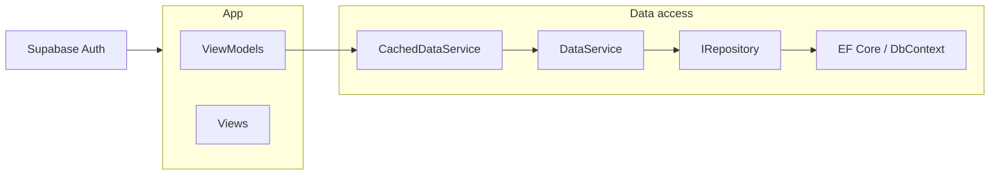

# AGENTS.md

Guidance for AI agents (Cursor) working on this repository. Human-facing documentation is in Russian elsewhere.

---

## Project overview

- **Type**: WinUI 3 desktop application, .NET 10, Windows App SDK.
- **Domain**: University methodological department — faculties, departments, sections, employees, disciplines, curriculum items, specialties.
- **Backend**: Supabase (PostgreSQL + Auth). Data access via Entity Framework Core and Npgsql; RLS for authorization.
- **Projects**: `UniversityMethodologicalDepartment.App` (UI, ViewModels, app services), `UniversityMethodologicalDepartment.Bus` (entities, repositories, data services), `UniversityMethodologicalDepartment.Tests` (xUnit, real DB).

---

## Scope

- **In scope**: Only the `UniversityMethodologicalDepartment.*` projects and the `supabase/` folder used by this app.
- **WinUI-Gallery**: Read-only. Use it as a reference or for samples; **never modify** it.

---

## Task approach

1. **Understand** the domain and existing data layer (entities, `IDataService`, `CachedDataService`, repositories).
2. **Prefer existing abstractions** in this order: use the cache decorator (`IDataService` → `CachedDataService`) when caching is appropriate; use `DataService` for uncached reads/writes; extend or add repositories only when a new query or mutation is needed.
3. **Bus first**: Changes to contracts, services, and repositories live in `.Bus`. Then wire and use them in `.App` (ViewModels, Views, app services).
4. **No direct Supabase** in app logic — Supabase is used only for authentication; all DB access goes through the data layer (decorator → DataService → repository → EF Core).

---

## Build

Solution file: [UniversityMethodologicalDepartment.slnx](UniversityMethodologicalDepartment.slnx).

From the repository root:

**Build entire solution (recommended):**
```powershell
dotnet build UniversityMethodologicalDepartment.slnx
```

**Build individual projects:**
```powershell
# Bus (no app dependency)
dotnet build UniversityMethodologicalDepartment.Bus/UniversityMethodologicalDepartment.Bus.csproj

# Tests (depends on Bus)
dotnet build UniversityMethodologicalDepartment.Tests/UniversityMethodologicalDepartment.Tests.csproj

# App (depends on Bus)
dotnet build UniversityMethodologicalDepartment.App/UniversityMethodologicalDepartment.App.csproj
```

---

## Architecture and data flow

- **Bus**: Entities, `AppDbContext`, repositories (`IRepository<>`), `DataService`, `CachedDataService` (implements `IDataService`). All domain and data-access logic.
- **App**: Views (XAML), ViewModels, app-specific services (navigation, theme, auth, clipboard, etc.). ViewModels live in the App project; DI is configured in [App.xaml.cs](UniversityMethodologicalDepartment.App/App.xaml.cs).

Data access flow (prefer from top to bottom):



- **Supabase**: Used only for auth (session, credentials). No direct Supabase client calls for business data; all reads/writes go through `IDataService` → DataService → repositories → EF Core.

Key files:
- [UniversityMethodologicalDepartment.App/App.xaml.cs](UniversityMethodologicalDepartment.App/App.xaml.cs) — DI registration.
- [UniversityMethodologicalDepartment.Bus/Services/DataService.cs](UniversityMethodologicalDepartment.Bus/Services/DataService.cs), [CachedDataService.cs](UniversityMethodologicalDepartment.Bus/Services/CachedDataService.cs) — data layer.

### Cache refresh events and UI thread

When `IDataService` exposes a cache-refresh event (e.g. `CacheRefreshed`), it is raised from a **background thread** (e.g. after `RefreshXxxAsync` or async load from DB). Any subscriber that updates UI (collections, status, bindings) **must** marshal to the UI thread first (e.g. `DispatcherQueue.RunAsync` in WinUI 3 or the app’s `SynchronizationContext`). Do not update observable collections or status from the event handler’s thread; document or enforce this in handlers that touch the UI.

---

## Entities and migrations

### Entities (scaffolded — do not edit)

- [UniversityMethodologicalDepartment.Bus/Entities/](UniversityMethodologicalDepartment.Bus/Entities/) is **generated** by [scripts/scaffold-db.ps1](scripts/scaffold-db.ps1) (EF Core scaffold from PostgreSQL). Do **not** modify files in `Entities/` directly; they can be regenerated at any time.
- For **entity or DbContext extensions** (e.g. computed props, interceptors), use **partial classes** in [Entities/Extensions/](UniversityMethodologicalDepartment.Bus/Entities/Extensions/) and keep them out of the scaffold output.

### Migrations

- Migrations live in [supabase/migrations/](supabase/migrations/). Local DB is typically reset with `npx supabase db reset`.
- **Default**: When schema changes are needed, **edit existing** migration files. Do **not** create new migrations unless explicitly asked.

---

## Configuration and testing

- **Database**: Docker (Supabase). Use [appsettings.dev.json](UniversityMethodologicalDepartment.App/appsettings.dev.json) for local/dev configuration.
- **Tests**: Run against the real database (Docker). No CI; single-commit course project, no git workflow to document.

---

## Conventions

- **Platform**: Windows only.
- **Secrets**: No hardcoded keys or connection strings; use configuration (e.g. `appsettings.dev.json`).
- **Data access**: Prefer existing cache decorator and `DataService` before adding or changing repositories. No direct Supabase usage except for auth.
- **Code quality**: Write clear, maintainable code; avoid unnecessary simplification or over-engineering.
- **Debug output**: Use only Latin characters in `Debug.WriteLine` (and similar diagnostic messages) so that logs are readable regardless of console/IDE encoding.
