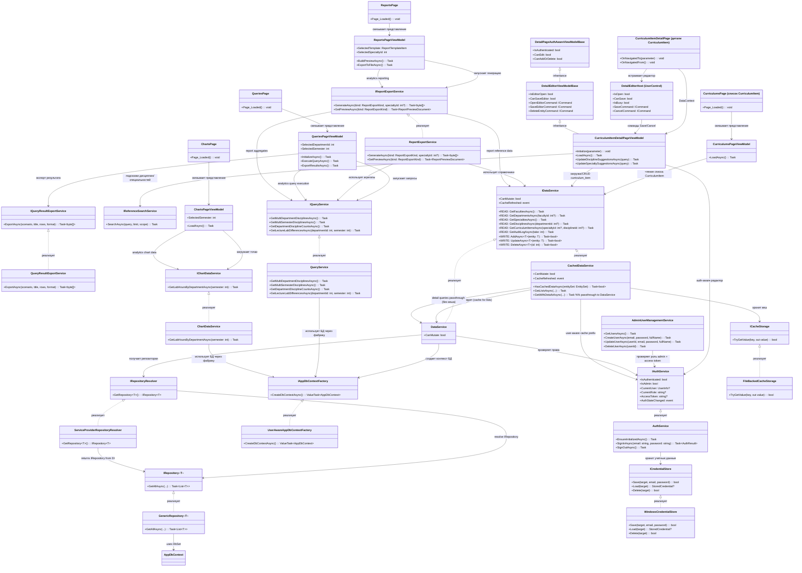

# Классы проектирования

```mermaid
classDiagram
    %% Presentation (страницы + VM)
    class ReportsPage["ReportsPage"] { +Page_Loaded(): void }
    class QueriesPage["QueriesPage"] { +Page_Loaded(): void }
    class ChartsPage["ChartsPage"] { +Page_Loaded(): void }
    class CurriculumItemsPage["CurriculumsPage (список CurriculumItem)"] { +Page_Loaded(): void }
    class CurriculumItemDetailPage["CurriculumItemDetailPage (детали CurriculumItem)"] {
        +OnNavigatedTo(parameter): void
        +OnNavigatedFrom(): void
    }
    class DetailEditorHost["DetailEditorHost (UserControl)"] {
        +IsOpen: bool
        +CanSave: bool
        +IsBusy: bool
        +SaveCommand: ICommand
        +CancelCommand: ICommand
    }

    class ReportsPageViewModel["ReportsPageViewModel"] {
        +SelectedTemplate: ReportTemplateItem
        +SelectedSpecialtyId: int
        +BuildPreviewAsync(): Task
        +ExportToFileAsync(): Task
    }
    class QueriesPageViewModel["QueriesPageViewModel"] {
        +SelectedDepartmentId: int
        +SelectedSemester: int
        +InitializeAsync(): Task
        +ExecuteQueryAsync(): Task
        +ExportResultsAsync(): Task
    }
    class ChartsPageViewModel["ChartsPageViewModel"] {
        +SelectedSemester: int
        +LoadAsync(): Task
    }
    class CurriculumItemsPageViewModel["CurriculumsPageViewModel"] {
        +LoadAsync(): Task
    }
    class DetailPageAuthAwareViewModelBase["DetailPageAuthAwareViewModelBase"] {
        +IsAuthenticated: bool
        +CanEdit: bool
        +CanAddOrDelete: bool
    }
    class DetailEditorViewModelBase["DetailEditorViewModelBase"] {
        +IsEditorOpen: bool
        +CanSaveEditor: bool
        +OpenEditorCommand: ICommand
        +SaveEditorCommand: ICommand
        +DeleteEntityCommand: ICommand
    }
    class CurriculumItemDetailPageViewModel["CurriculumItemDetailPageViewModel"] {
        +Initialize(parameter): void
        +LoadAsync(): Task
        +UpdateDisciplineSuggestionsAsync(query): Task
        +UpdateSpecialtySuggestionsAsync(query): Task
    }
    class IReferenceSearchService["IReferenceSearchService"] {
        +SearchAsync(query, limit, scope): Task
    }

    %% Analytics/report services
    class IReportExportService["IReportExportService"] {
        +GenerateAsync(kind: ReportExportKind, specialtyId: int?): Task~byte[]~
        +GetPreviewAsync(kind: ReportExportKind): Task~ReportPreviewDocument~
    }
    class ReportExportService["ReportExportService"] {
        +GenerateAsync(kind: ReportExportKind, specialtyId: int?): Task~byte[]~
        +GetPreviewAsync(kind: ReportExportKind): Task~ReportPreviewDocument~
    }
    class IQueryResultExportService["IQueryResultExportService"] {
        +ExportAsync(scenario, title, rows, format): Task~byte[]~
    }
    class QueryResultExportService["QueryResultExportService"] {
        +ExportAsync(scenario, title, rows, format): Task~byte[]~
    }
    class IQueryService["IQueryService"] {
        +GetMultiDepartmentDisciplinesAsync(): Task
        +GetMultiSemesterDisciplinesAsync(): Task
        +GetDepartmentDisciplineCountsAsync(): Task
        +GetLectureLabDifferencesAsync(departmentId: int, semester: int): Task
    }
    class QueryService["QueryService"] {
        +GetMultiDepartmentDisciplinesAsync(): Task
        +GetMultiSemesterDisciplinesAsync(): Task
        +GetDepartmentDisciplineCountsAsync(): Task
        +GetLectureLabDifferencesAsync(departmentId: int, semester: int): Task
    }
    class IChartDataService["IChartDataService"] {
        +GetLabHoursByDepartmentAsync(semester: int): Task
    }
    class ChartDataService["ChartDataService"] {
        +GetLabHoursByDepartmentAsync(semester: int): Task
    }

    %% App/Bus boundary
    class IDataService["IDataService"] {
        +CanMutate: bool
        +CacheRefreshed: event
        +READ: GetFacultiesAsync(): Task
        +READ: GetDepartmentsAsync(facultyId: int?): Task
        +READ: GetSpecialtiesAsync(): Task
        +READ: GetDisciplinesAsync(departmentId: int?): Task
        +READ: GetCurriculumItemsAsync(specialtyId: int?, disciplineId: int?): Task
        +READ: GetAuditLogAsync(take: int): Task
        +WRITE: AddAsync~T~(entity: T): Task~bool~
        +WRITE: UpdateAsync~T~(entity: T): Task~bool~
        +WRITE: DeleteAsync~T~(id: int): Task~bool~
    }

    %% Data/infrastructure
    class DataService["DataService"] { +CanMutate: bool }
    class CachedDataService["CachedDataService"] {
        +CanMutate: bool
        +CacheRefreshed: event
        +HasCachedDataAsync(entitySet: EntitySet): Task~bool~
        +Get*Lists*Async(...): Task
        +Get*WithDetails*Async(...): Task  %% passthrough to DataService
    }
    class IAuthService["IAuthService"] {
        +IsAuthenticated: bool
        +IsAdmin: bool
        +CurrentUser: UserInfo?
        +CurrentRole: string?
        +AccessToken: string?
        +AuthStateChanged: event
    }
    class AuthService["AuthService"] {
        +EnsureInitializedAsync(): Task
        +SignInAsync(email: string, password: string): Task~AuthResult~
        +SignOutAsync(): Task
    }
    class AdminUserManagementService["AdminUserManagementService"] {
        +GetUsersAsync(): Task
        +CreateUserAsync(email, password, fullName): Task
        +UpdateUserAsync(userId, email, password, fullName): Task
        +DeleteUserAsync(userId): Task
    }
    class IAppDbContextFactory["IAppDbContextFactory"] { +CreateDbContextAsync(): ValueTask~AppDbContext~ }
    class UserAwareAppDbContextFactory["UserAwareAppDbContextFactory"] { +CreateDbContextAsync(): ValueTask~AppDbContext~ }
    class AppDbContext["AppDbContext"]
    class IRepositoryT["IRepository~T~"] { +GetAllAsync(...): Task~List~T~~ }
    class GenericRepositoryT["GenericRepository~T~"] { +GetAllAsync(...): Task~List~T~~ }
    class IRepositoryResolver["IRepositoryResolver"] { +GetRepository~T~(): IRepository~T~ }
    class ServiceProviderRepositoryResolver["ServiceProviderRepositoryResolver"] { +GetRepository~T~(): IRepository~T~ }
    class ICacheStorage["ICacheStorage"] { +TryGetValue(key, out value): bool }
    class FileBackedCacheStorage["FileBackedCacheStorage"] { +TryGetValue(key, out value): bool }
    class ICredentialStore["ICredentialStore"] {
        +Save(target, email, password): bool
        +Load(target): StoredCredential?
        +Delete(target): bool
    }
    class WindowsCredentialStore["WindowsCredentialStore"] {
        +Save(target, email, password): bool
        +Load(target): StoredCredential?
        +Delete(target): bool
    }

    %% Реализации и связи
    IDataService <|.. DataService : реализует
    IDataService <|.. CachedDataService : реализует
    IAuthService <|.. AuthService : реализует
    IAppDbContextFactory <|.. UserAwareAppDbContextFactory : реализует
    IRepositoryT <|.. GenericRepositoryT : реализует
    IRepositoryResolver <|.. ServiceProviderRepositoryResolver : реализует
    ICacheStorage <|.. FileBackedCacheStorage : реализует
    ICredentialStore <|.. WindowsCredentialStore : реализует
    IQueryService <|.. QueryService : реализует
    IChartDataService <|.. ChartDataService : реализует
    IReportExportService <|.. ReportExportService : реализует
    IQueryResultExportService <|.. QueryResultExportService : реализует

    ReportsPage --> ReportsPageViewModel : связывает представление
    QueriesPage --> QueriesPageViewModel : связывает представление
    ChartsPage --> ChartsPageViewModel : связывает представление
    CurriculumItemsPage --> CurriculumItemsPageViewModel : связывает представление
    CurriculumItemDetailPage --> CurriculumItemDetailPageViewModel : DataContext
    CurriculumItemDetailPage --> DetailEditorHost : встраивает редактор
    DetailEditorHost --> CurriculumItemDetailPageViewModel : команды Save/Cancel

    DetailPageAuthAwareViewModelBase <|-- DetailEditorViewModelBase : inheritance
    DetailEditorViewModelBase <|-- CurriculumItemDetailPageViewModel : inheritance

    ReportsPageViewModel --> IReportExportService : запускает генерацию
    QueriesPageViewModel --> IQueryService : запускает запросы
    QueriesPageViewModel --> IQueryResultExportService : экспорт результата
    ChartsPageViewModel --> IChartDataService : загружает точки
    CurriculumItemsPageViewModel --> IDataService : чтение списка CurriculumItem
    CurriculumItemDetailPageViewModel --> IDataService : загрузка/CRUD curriculum_item
    CurriculumItemDetailPageViewModel --> IReferenceSearchService : подсказки дисциплин/специальностей
    CurriculumItemDetailPageViewModel --> IAuthService : auth-aware редактор

    ReportExportService --> IQueryService : использует агрегаты
    ReportExportService --> IDataService : использует справочники
    AdminUserManagementService --> IAuthService : проверяет роль admin + access token

    DataService --> IAppDbContextFactory : создает контекст БД
    DataService --> IRepositoryResolver : получает репозитории
    DataService --> IAuthService : проверяет права
    CachedDataService --> DataService : декорирует (cache for lists)
    CachedDataService --> IAuthService : user-aware cache prefix
    CachedDataService --> ICacheStorage : хранит кеш
    CachedDataService --> DataService : detail queries passthrough (без кеша)
    QueryService --> IAppDbContextFactory : использует БД через фабрику
    ChartDataService --> IAppDbContextFactory : использует БД через фабрику
    AuthService --> ICredentialStore : хранит учетные данные
    IRepositoryResolver --> IRepositoryT : resolve IRepository<T>
    ServiceProviderRepositoryResolver --> IRepositoryT : returns IRepository<T> from DI
    GenericRepositoryT --> AppDbContext : uses DbSet<T>

    %% Аналитический контур
    QueriesPageViewModel --> IQueryService : analytics query execution
    ChartsPageViewModel --> IChartDataService : analytics chart data
    ReportsPageViewModel --> IReportExportService : analytics reporting
    IReportExportService --> IQueryService : report aggregates
    IReportExportService --> IDataService : report reference data
```

