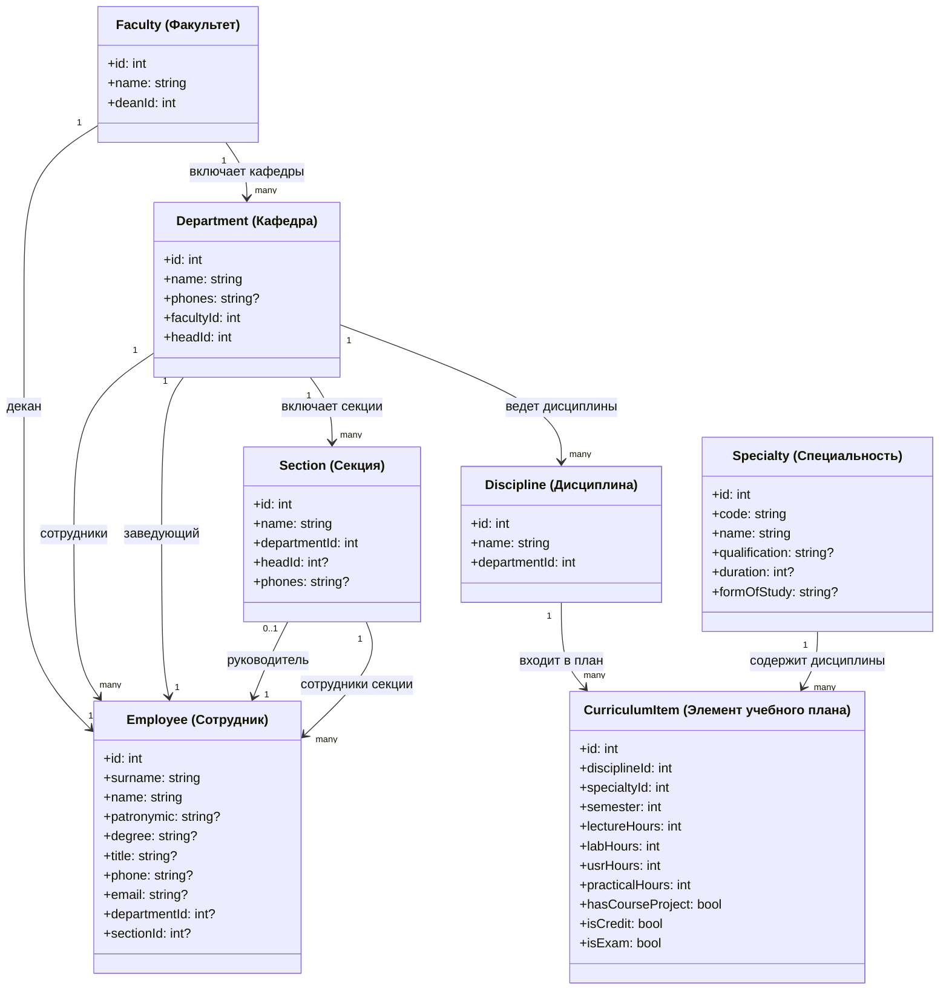

# Классы-сущности (Domain Model)

```mermaid
classDiagram
    class Faculty["Faculty (Факультет)"] {
        +id: int
        +name: string
        +deanId: int
    }
    class Department["Department (Кафедра)"] {
        +id: int
        +name: string
        +phones: string?
        +facultyId: int
        +headId: int
    }
    class Employee["Employee (Сотрудник)"] {
        +id: int
        +surname: string
        +name: string
        +patronymic: string?
        +degree: string?
        +title: string?
        +phone: string?
        +email: string?
        +departmentId: int?
        +sectionId: int?
    }
    class Section["Section (Секция)"] {
        +id: int
        +name: string
        +departmentId: int
        +headId: int?
        +phones: string?
    }
    class Discipline["Discipline (Дисциплина)"] {
        +id: int
        +name: string
        +departmentId: int
    }
    class Specialty["Specialty (Специальность)"] {
        +id: int
        +code: string
        +name: string
        +qualification: string?
        +duration: int?
        +formOfStudy: string?
    }
    class CurriculumItem["CurriculumItem (Элемент учебного плана)"] {
        +id: int
        +disciplineId: int
        +specialtyId: int
        +semester: int
        +lectureHours: int
        +labHours: int
        +usrHours: int
        +practicalHours: int
        +hasCourseProject: bool
        +isCredit: bool
        +isExam: bool
    }

    Faculty "1" --> "many" Department : включает кафедры
    Faculty "1" --> "1" Employee : декан
    Department "1" --> "many" Employee : сотрудники
    Department "1" --> "many" Section : включает секции
    Department "1" --> "many" Discipline : ведет дисциплины
    Department "1" --> "1" Employee : заведующий
    Section "0..1" --> "1" Employee : руководитель
    Section "1" --> "many" Employee : сотрудники секции
    Discipline "1" --> "many" CurriculumItem : входит в план
    Specialty "1" --> "many" CurriculumItem : содержит дисциплины
```