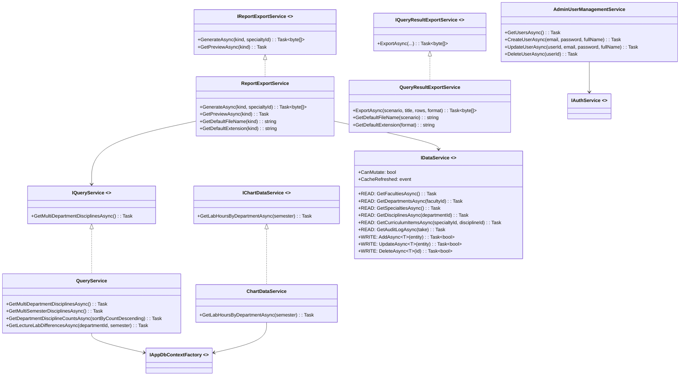
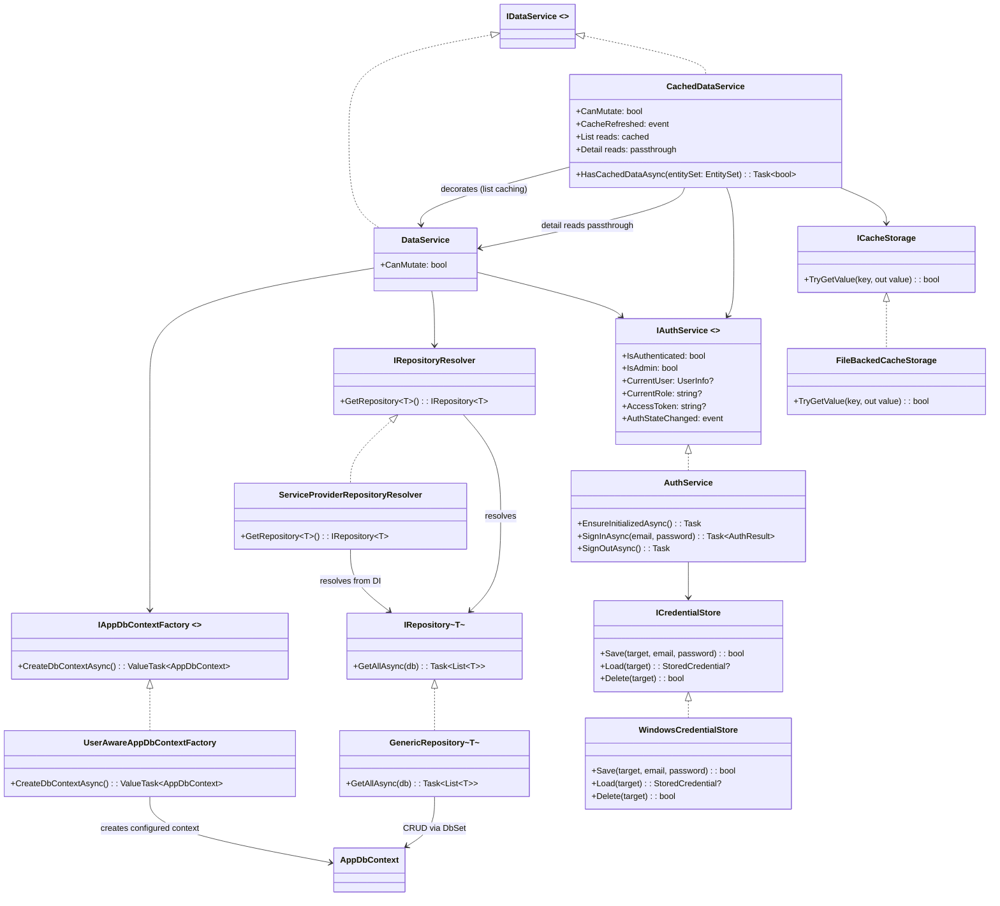

# Классы по слоям приложения

## Слой UI и ViewModels

```mermaid
classDiagram
    class ReportsPage["ReportsPage"] { +Page_Loaded(): void }
    class QueriesPage["QueriesPage"] { +Page_Loaded(): void }
    class ChartsPage["ChartsPage"] { +Page_Loaded(): void }
    class CurriculumItemsPage["CurriculumsPage (список CurriculumItem)"] {
        +Page_Loaded(): void
        +ListView_ItemClick(item): void
        +CreateButton_Click(): void
    }
    class CurriculumItemDetailPage["CurriculumItemDetailPage (детали CurriculumItem)"] {
        +OnNavigatedTo(parameter): void
        +OnNavigatedFrom(): void
        +DisciplineAutoSuggestBox_TextChanged(...): void
        +SpecialtyAutoSuggestBox_TextChanged(...): void
    }
    class DetailEditorHost["DetailEditorHost"] {
        +IsOpen: bool
        +CanSave: bool
        +IsBusy: bool
        +SaveCommand: ICommand
        +CancelCommand: ICommand
    }

    class ReportsPageViewModel["ReportsPageViewModel"] {
        +SelectedTemplate: ReportTemplateItem
        +SelectedSpecialtyId: int
        +BuildPreviewAsync(): Task
        +ExportToFileAsync(): Task
    }
    class QueriesPageViewModel["QueriesPageViewModel"] {
        +SelectedQuery: QueryOptionItem
        +SelectedDepartmentId: int
        +SelectedSemester: int
        +InitializeAsync(): Task
        +ExecuteQueryAsync(): Task
        +ExportResultsAsync(): Task
    }
    class ChartsPageViewModel["ChartsPageViewModel"] {
        +SelectedSemester: int
        +LoadAsync(): Task
    }
    class CurriculumItemsPageViewModel["CurriculumsPageViewModel"] {
        +LoadAsync(): Task
        +MatchesSearch(item, text): bool
    }
    class DetailPageAuthAwareViewModelBase["DetailPageAuthAwareViewModelBase"] {
        +IsAuthenticated: bool
        +CanEdit: bool
        +CanAddOrDelete: bool
    }
    class DetailEditorViewModelBase["DetailEditorViewModelBase"] {
        +IsEditorOpen: bool
        +CanSaveEditor: bool
        +OpenEditorCommand: ICommand
        +SaveEditorCommand: ICommand
        +DeleteEntityCommand: ICommand
    }
    class CurriculumItemDetailPageViewModel["CurriculumItemDetailPageViewModel"] {
        +Initialize(parameter): void
        +LoadAsync(): Task
        +UpdateDisciplineSuggestionsAsync(query): Task
        +UpdateSpecialtySuggestionsAsync(query): Task
    }

    class IReportExportService["IReportExportService <<bridge>>"]
    class IQueryService["IQueryService <<bridge>>"]
    class IQueryResultExportService["IQueryResultExportService <<bridge>>"]
    class IChartDataService["IChartDataService <<bridge>>"]
    class IDataService["IDataService <<bridge>>"]
    class IReferenceSearchService["IReferenceSearchService <<bridge>>"]
    class IAuthService["IAuthService <<bridge>>"]

    ReportsPage --> ReportsPageViewModel
    QueriesPage --> QueriesPageViewModel
    ChartsPage --> ChartsPageViewModel
    CurriculumItemsPage --> CurriculumItemsPageViewModel
    CurriculumItemDetailPage --> CurriculumItemDetailPageViewModel
    CurriculumItemDetailPage --> DetailEditorHost
    DetailEditorHost --> CurriculumItemDetailPageViewModel : bind commands/state

    DetailPageAuthAwareViewModelBase <|-- DetailEditorViewModelBase
    DetailEditorViewModelBase <|-- CurriculumItemDetailPageViewModel

    ReportsPageViewModel --> IReportExportService : uses
    QueriesPageViewModel --> IQueryService : uses
    QueriesPageViewModel --> IQueryResultExportService : export
    ChartsPageViewModel --> IChartDataService : uses
    CurriculumItemsPageViewModel --> IDataService : uses (CurriculumItem list)
    CurriculumItemDetailPageViewModel --> IDataService : CRUD + details
    CurriculumItemDetailPageViewModel --> IReferenceSearchService : autosuggest
    CurriculumItemDetailPageViewModel --> IAuthService : auth-aware editor
```

## Слой бизнес-логики и сервисов

```mermaid
classDiagram
    class IReportExportService["IReportExportService <<from UI>>"] {
        +GenerateAsync(kind, specialtyId): Task~byte[]~
        +GetPreviewAsync(kind): Task
    }
    class IQueryService["IQueryService <<from UI>>"] { +GetMultiDepartmentDisciplinesAsync(): Task }
    class IQueryResultExportService["IQueryResultExportService <<from UI>>"] { +ExportAsync(...): Task~byte[]~ }
    class IChartDataService["IChartDataService <<from UI>>"] { +GetLabHoursByDepartmentAsync(semester): Task }
    class IDataService["IDataService <<bridge>>"] {
        +CanMutate: bool
        +CacheRefreshed: event
        +READ: GetFacultiesAsync(): Task
        +READ: GetDepartmentsAsync(facultyId): Task
        +READ: GetSpecialtiesAsync(): Task
        +READ: GetDisciplinesAsync(departmentId): Task
        +READ: GetCurriculumItemsAsync(specialtyId, disciplineId): Task
        +READ: GetAuditLogAsync(take): Task
        +WRITE: AddAsync~T~(entity): Task~bool~
        +WRITE: UpdateAsync~T~(entity): Task~bool~
        +WRITE: DeleteAsync~T~(id): Task~bool~
    }

    class ReportExportService["ReportExportService"] {
        +GenerateAsync(kind, specialtyId): Task~byte[]~
        +GetPreviewAsync(kind): Task
        +GetDefaultFileName(kind): string
        +GetDefaultExtension(kind): string
    }
    class QueryService["QueryService"] {
        +GetMultiDepartmentDisciplinesAsync(): Task
        +GetMultiSemesterDisciplinesAsync(): Task
        +GetDepartmentDisciplineCountsAsync(sortByCountDescending): Task
        +GetLectureLabDifferencesAsync(departmentId, semester): Task
    }
    class QueryResultExportService["QueryResultExportService"] {
        +ExportAsync(scenario, title, rows, format): Task~byte[]~
        +GetDefaultFileName(scenario): string
        +GetDefaultExtension(format): string
    }
    class ChartDataService["ChartDataService"] {
        +GetLabHoursByDepartmentAsync(semester): Task
    }
    class AdminUserManagementService["AdminUserManagementService"] {
        +GetUsersAsync(): Task
        +CreateUserAsync(email, password, fullName): Task
        +UpdateUserAsync(userId, email, password, fullName): Task
        +DeleteUserAsync(userId): Task
    }

    class IAppDbContextFactory["IAppDbContextFactory <<to infra>>"]
    class IAuthService["IAuthService <<to infra>>"]

    IReportExportService <|.. ReportExportService
    IQueryService <|.. QueryService
    IQueryResultExportService <|.. QueryResultExportService
    IChartDataService <|.. ChartDataService

    ReportExportService --> IQueryService
    ReportExportService --> IDataService
    QueryService --> IAppDbContextFactory
    ChartDataService --> IAppDbContextFactory
    AdminUserManagementService --> IAuthService
```

## Слой данных и инфраструктуры

```mermaid
classDiagram
    class IDataService["IDataService <<from services>>"]
    class IAppDbContextFactory["IAppDbContextFactory <<from services>>"] {
        +CreateDbContextAsync(): ValueTask~AppDbContext~
    }
    class IAuthService["IAuthService <<from services>>"] {
        +IsAuthenticated: bool
        +IsAdmin: bool
        +CurrentUser: UserInfo?
        +CurrentRole: string?
        +AccessToken: string?
        +AuthStateChanged: event
    }

    class DataService["DataService"] { +CanMutate: bool }
    class CachedDataService["CachedDataService"] {
        +CanMutate: bool
        +HasCachedDataAsync(entitySet: EntitySet): Task~bool~
        +CacheRefreshed: event
        +List reads: cached
        +Detail reads: passthrough
    }
    class UserAwareAppDbContextFactory["UserAwareAppDbContextFactory"] { +CreateDbContextAsync(): ValueTask~AppDbContext~ }
    class AuthService["AuthService"] {
        +EnsureInitializedAsync(): Task
        +SignInAsync(email, password): Task~AuthResult~
        +SignOutAsync(): Task
    }
    class IRepositoryT["IRepository~T~"] { +GetAllAsync(db): Task~List~T~~ }
    class GenericRepositoryT["GenericRepository~T~"] { +GetAllAsync(db): Task~List~T~~ }
    class IRepositoryResolver["IRepositoryResolver"] { +GetRepository~T~(): IRepository~T~ }
    class ServiceProviderRepositoryResolver["ServiceProviderRepositoryResolver"] { +GetRepository~T~(): IRepository~T~ }
    class ICacheStorage["ICacheStorage"] { +TryGetValue(key, out value): bool }
    class FileBackedCacheStorage["FileBackedCacheStorage"] { +TryGetValue(key, out value): bool }
    class ICredentialStore["ICredentialStore"] {
        +Save(target, email, password): bool
        +Load(target): StoredCredential?
        +Delete(target): bool
    }
    class WindowsCredentialStore["WindowsCredentialStore"] {
        +Save(target, email, password): bool
        +Load(target): StoredCredential?
        +Delete(target): bool
    }
    class AppDbContext["AppDbContext"]

    IDataService <|.. DataService
    IDataService <|.. CachedDataService
    IAppDbContextFactory <|.. UserAwareAppDbContextFactory
    IAuthService <|.. AuthService
    IRepositoryT <|.. GenericRepositoryT
    IRepositoryResolver <|.. ServiceProviderRepositoryResolver
    IRepositoryResolver --> IRepositoryT : resolves
    ServiceProviderRepositoryResolver --> IRepositoryT : resolves from DI
    GenericRepositoryT --> AppDbContext : CRUD via DbSet<T>
    UserAwareAppDbContextFactory --> AppDbContext : creates configured context
    ICacheStorage <|.. FileBackedCacheStorage
    ICredentialStore <|.. WindowsCredentialStore

    DataService --> IAppDbContextFactory
    DataService --> IRepositoryResolver
    DataService --> IAuthService
    CachedDataService --> DataService : decorates (list caching)
    CachedDataService --> DataService : detail reads passthrough
    CachedDataService --> IAuthService
    CachedDataService --> ICacheStorage
    AuthService --> ICredentialStore
```