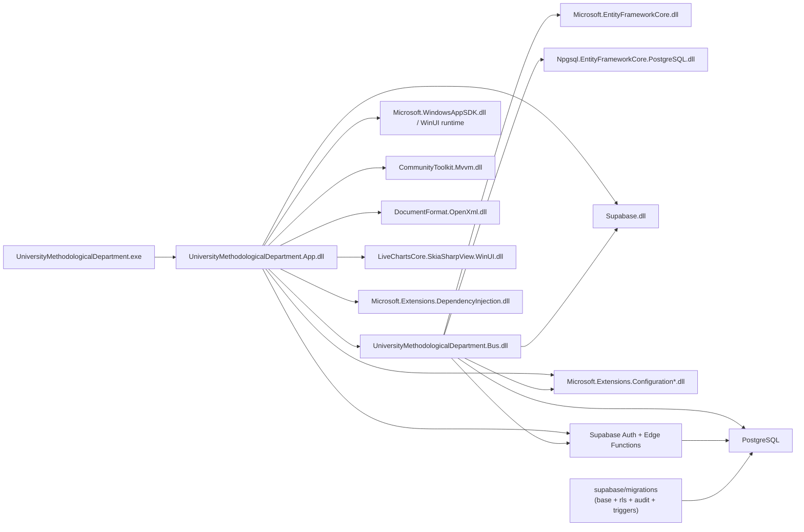

# Пункт 2. Component Diagram

Тот же состав узлов и связей в PlantUML: [components.puml](components.puml).

## Компонентная схема артефактов сборки (EXE/DLL)

## Пояснение

В данной диаграмме верхний уровень представлен исполняемым файлом `UniversityMethodologicalDepartment.exe`, который загружает прикладной модуль `UniversityMethodologicalDepartment.App.dll`. Прикладной модуль использует модуль доменной и data-логики `UniversityMethodologicalDepartment.Bus.dll`, а также основные внешние библиотеки из NuGet: WinUI runtime, MVVM toolkit, OpenXML, LiveCharts, EF Core, Npgsql, Supabase и компоненты конфигурации/DI.
