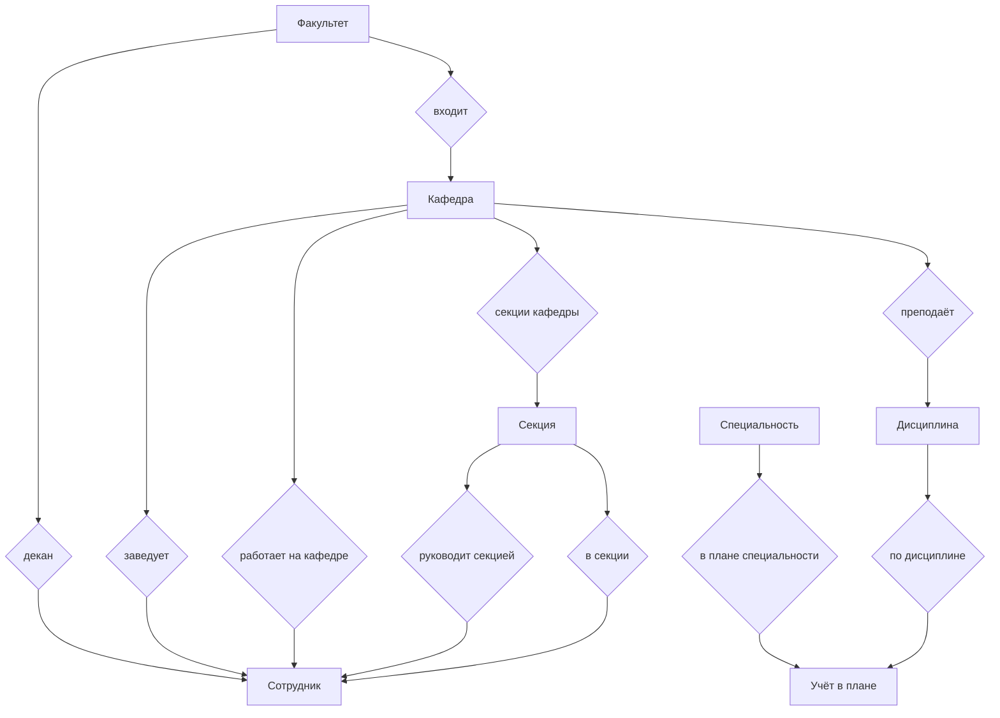

# Концептуальная модель данных

Концептуальная модель описывает предметную область **методического отдела** на уровне сущностей и **типов связей** между ними: кто с кем связан, **без** перечисления атрибутов, ключей и типов данных. Сущности — **прямоугольники**, каждая связь — **ромб** с подписью; между ними — **однонаправленные стрелки** вдоль цепочки «сущность → связь → сущность».

Детализация атрибутов и ограничений — в [логической модели](db-logical.md) и в [PlantUML IE](db-logical.puml).

**Границы модели:** на концептуальном уровне не показаны служебные механизмы (например, журнал аудита изменений в БД): они не выражают бизнес-структуру отдела, а поддерживают эксплуатацию системы.

Тот же состав узлов и стрелок в PlantUML: [db-conceptual.puml](db-conceptual.puml). Там узел связи нарисован **шестиугольником** (`hexagon`): в стандартном PlantUML нет отдельного ключевого слова «ромб», по смыслу это тот же узел типа связи между сущностями.
