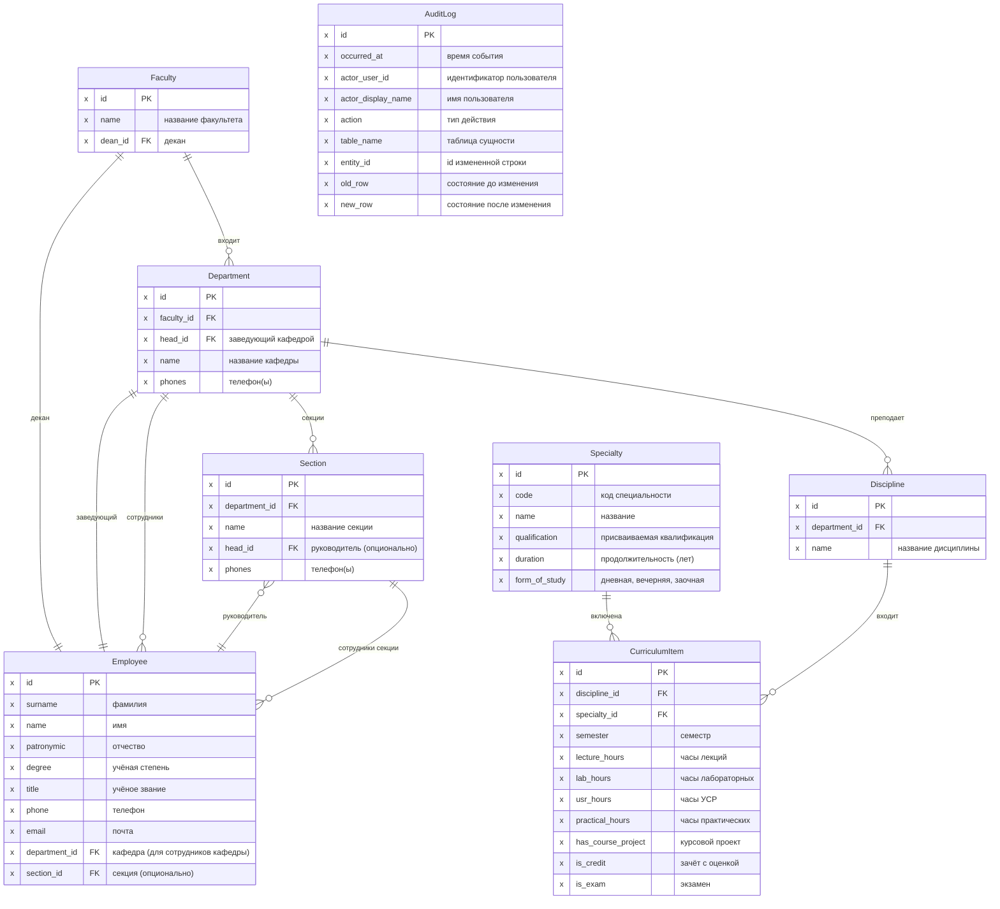

# Логическая диаграмма БД

Концептуальный уровень (сущности, ромбы типов связей, однонаправленные стрелки — см. [db-conceptual.md](db-conceptual.md), [db-conceptual.puml](db-conceptual.puml)).

Логическая модель данных предметной области методического отдела: сущности, их ключевые атрибуты и связи без технических деталей хранения.

Тот же состав сущностей и связей в PlantUML (IE-диаграмма, атрибуты без типов данных): [db-logical.puml](db-logical.puml).

