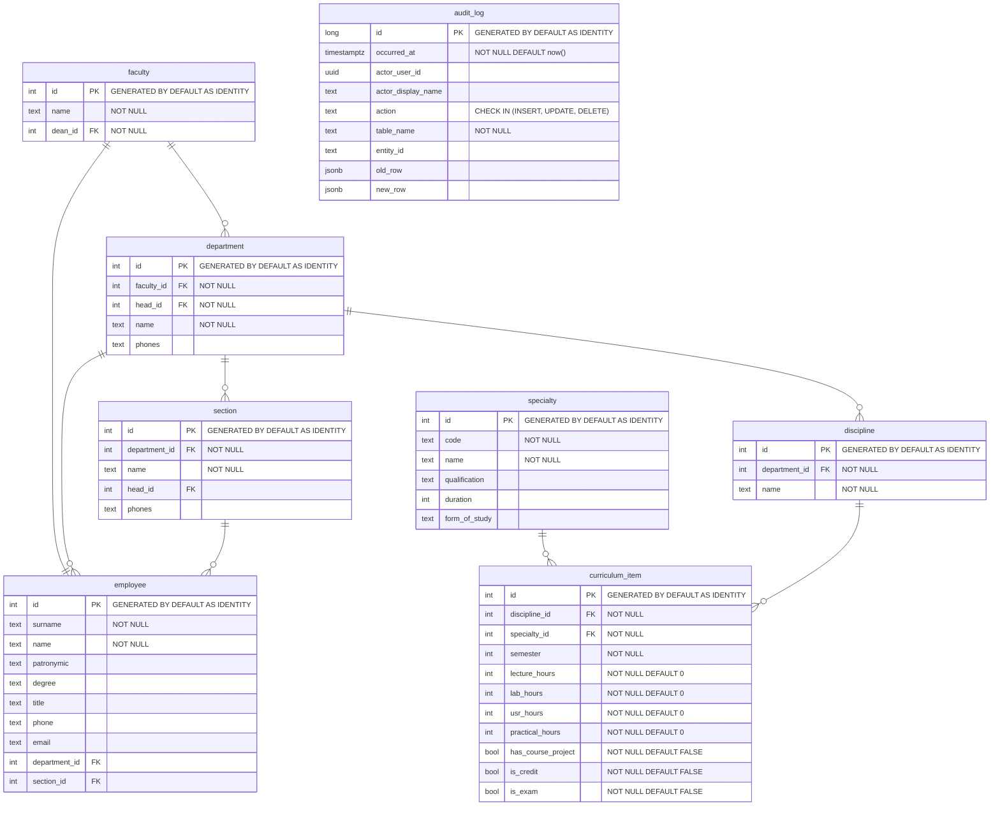

# Физическая диаграмма БД (PostgreSQL)

Физическая модель PostgreSQL, отражающая таблицы, типы полей, PK/FK-связи и ключевые ограничения.

Дополнительно в физической модели используются:
- уникальный индекс `idx_curriculum_item_unique` на `(discipline_id, specialty_id, semester)`;
- RLS-политики для таблиц предметной области;
- триггеры целостности (оргструктура) и аудит-триггеры для основных таблиц.
