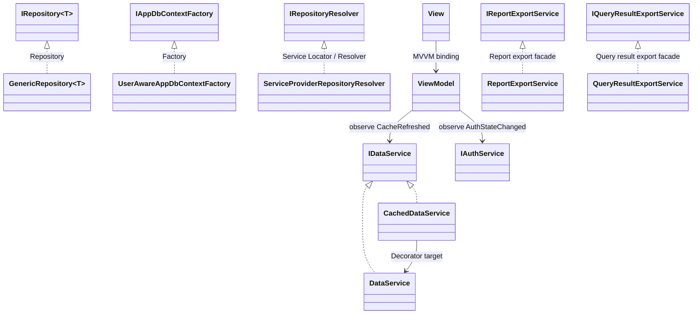

# Пункт 4. Паттерн(ы) проектирования

## Текущее состояние: существующие шаблоны

### 1) Decorator
- `CachedDataService` реализует `IDataService` и оборачивает `DataService` (снаружи подменяя его по интерфейсу `IDataService`).
- Назначение: добавить кэширование, не изменяя код базового сервиса.

### 2) Repository
- `IRepository<T>` + `GenericRepository<T>`.
- Назначение: унифицированный доступ к данным и абстракция CRUD.

### 3) Factory
- `IAppDbContextFactory` + `UserAwareAppDbContextFactory`.
- Назначение: централизованное создание `AppDbContext` с учетом пользователя.

### 4) Service Locator / Resolver
- `IRepositoryResolver` + `ServiceProviderRepositoryResolver`.
- Назначение: выбирать реализацию репозитория по типу сущности.

### 5) Dependency Injection (IoC)
- Регистрация сервисов в `App.xaml.cs` (`Singleton`/`Transient`).
- Назначение: управление временем жизни зависимостей и слабое связывание.

### 6) MVVM
- `Views` + `ViewModels` + биндинги команд/свойств.
- Назначение: разделение UI и логики представления.

### 7) Observer (события)
- `IAuthService.AuthStateChanged` и `IDataService.CacheRefreshed`.
- Назначение: реактивное обновление UI при изменении состояния авторизации и кеша.

### 8) Export Strategy by format/scenario
- `ReportExportService` и `QueryResultExportService` выбирают генерацию по enum-сценарию (`ReportExportKind`, `QueryExportFormat`).
- Назначение: единая точка экспорта без дублирования UI-логики в страницах.

## Общая диаграмма паттернов

## Примечание

- Отдельные классы `ExcelReportService`/`WordReportService` не используются: экспорт собран в `ReportExportService` с выбором по `ReportExportKind`.
- Экспорт результатов аналитических запросов также централизован в `QueryResultExportService` с выбором по `QueryExportFormat`.
