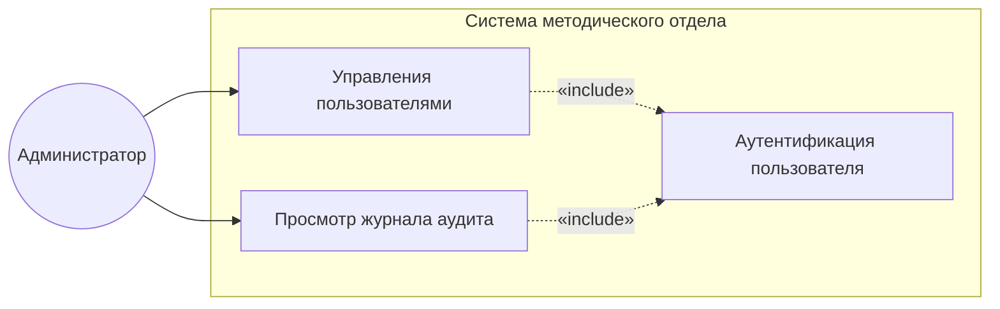

# Use Case — Актор: Администратор

```mermaid
flowchart LR
    subgraph system["Система методического отдела"]
        UC6[Управления пользователями]
        UC7[Просмотр журнала аудита]
        Auth[Аутентификация пользователя]
    end
    A3((Администратор))
    A3 --> UC6
    A3 --> UC7
    UC6 -.->|"«include»"| Auth
    UC7 -.->|"«include»"| Auth
```
