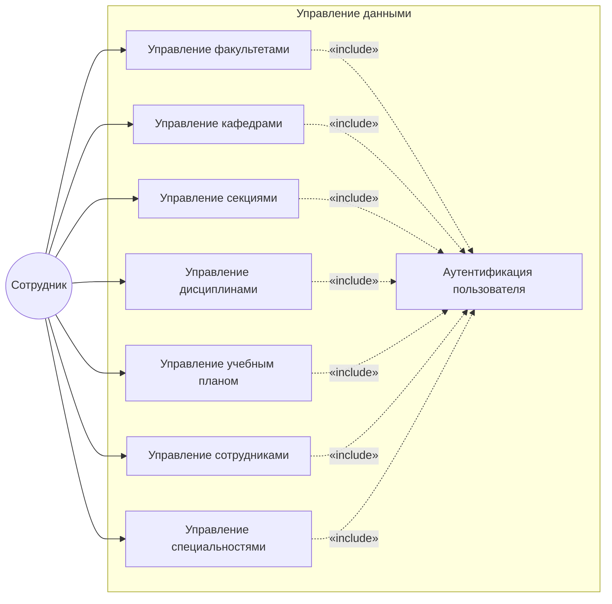

# Use Case — Актор: Сотрудник (управление данными)

```mermaid
flowchart LR
    subgraph system["Управление данными"]
        M1[Управление факультетами]
        M2[Управление кафедрами]
        M3[Управление секциями]
        M4[Управление дисциплинами]
        M5[Управление учебным планом]
        M6[Управление сотрудниками]
        M7[Управление специальностями]
        Auth[Аутентификация пользователя]
    end
    A2((Сотрудник))
    A2 --> M1
    A2 --> M2
    A2 --> M3
    A2 --> M4
    A2 --> M5
    A2 --> M6
    A2 --> M7
    M1 -.->|"«include»"| Auth
    M2 -.->|"«include»"| Auth
    M3 -.->|"«include»"| Auth
    M4 -.->|"«include»"| Auth
    M5 -.->|"«include»"| Auth
    M6 -.->|"«include»"| Auth
    M7 -.->|"«include»"| Auth
```
