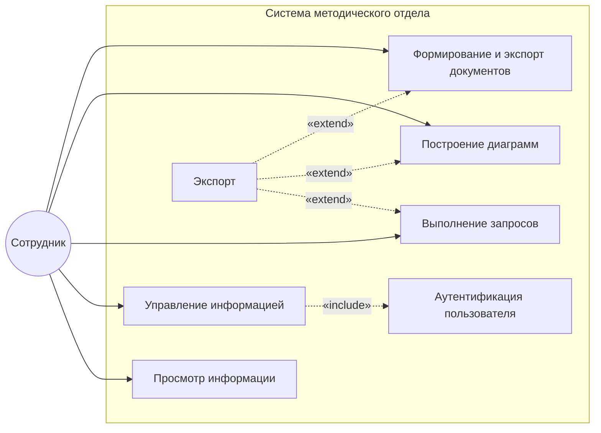

# Use Case — Актор: Сотрудник (общий)

```mermaid
flowchart LR
    subgraph system["Система методического отдела"]
        UC1[Просмотр информации]
        UC2[Управление информацией]
        UC3[Выполнение запросов]
        UC4[Построение диаграмм]
        UC5[Формирование и экспорт документов]
        Auth[Аутентификация пользователя]
        Export[Экспорт]
    end
    A1((Сотрудник))
    A1 --> UC1
    A1 --> UC2
    A1 --> UC3
    A1 --> UC4
    A1 --> UC5
    UC2 -.->|"«include»"| Auth
    Export -.->|"«extend»"| UC3
    Export -.->|"«extend»"| UC4
    Export -.->|"«extend»"| UC5
```
