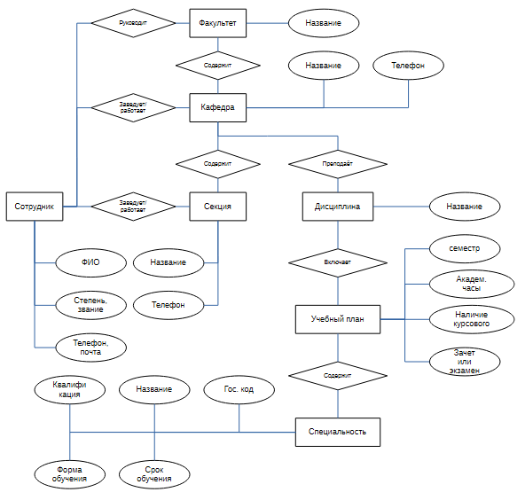
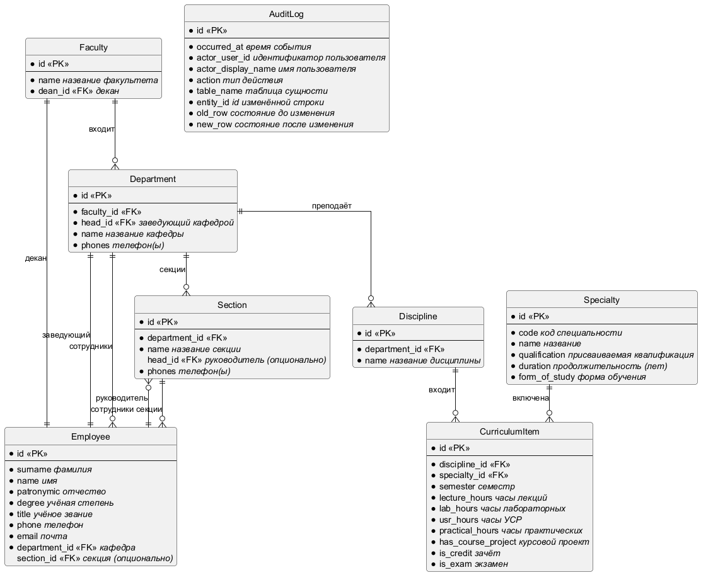
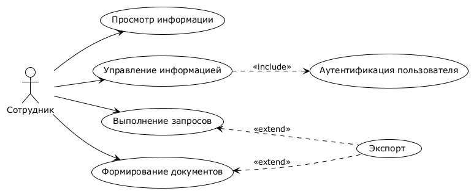
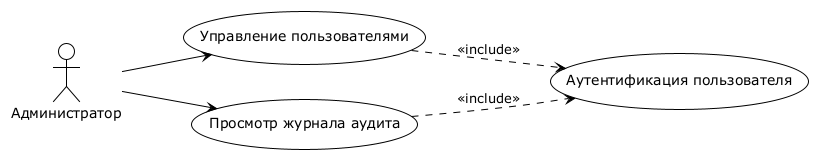
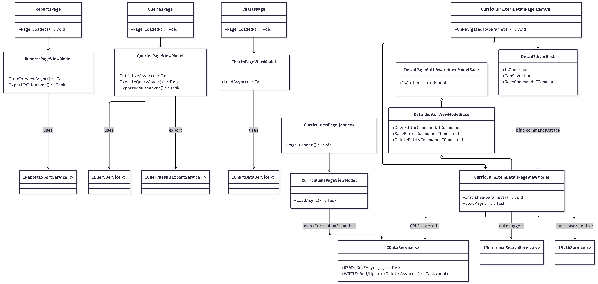
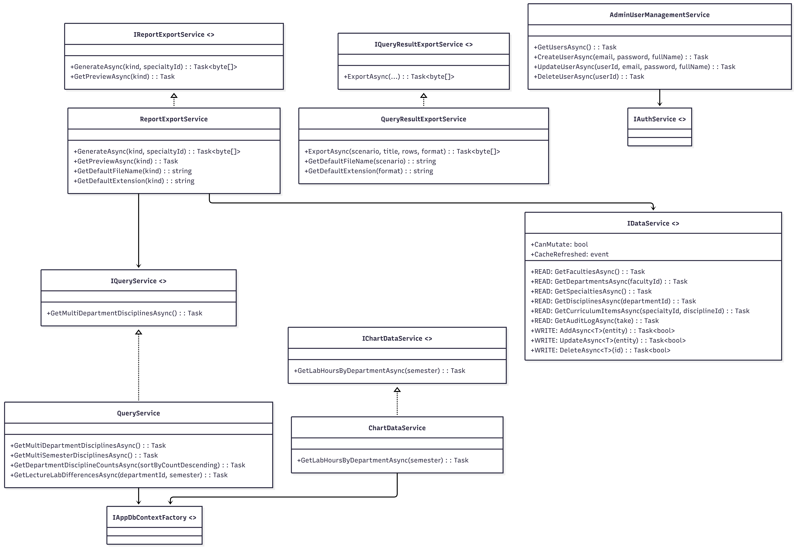
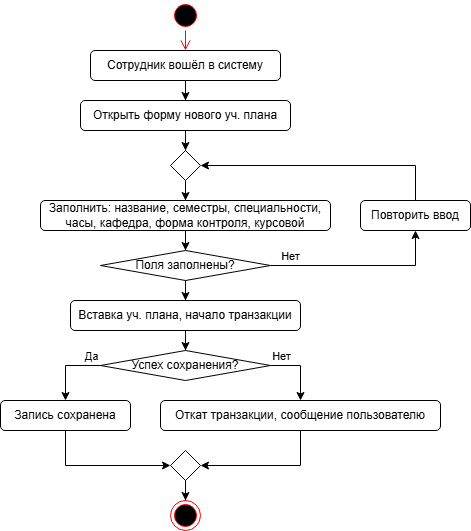
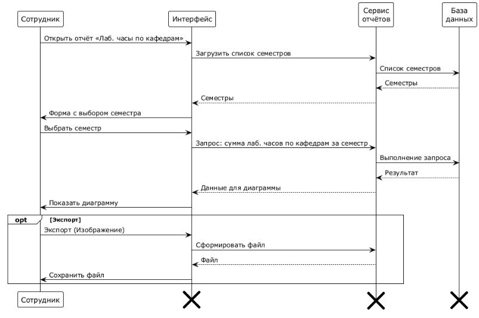
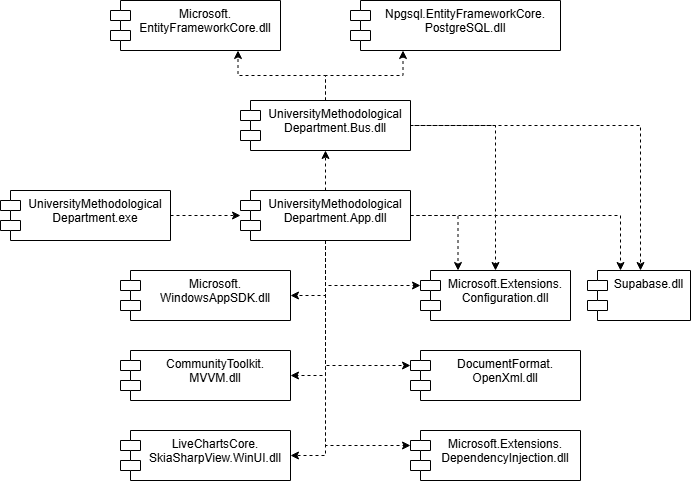
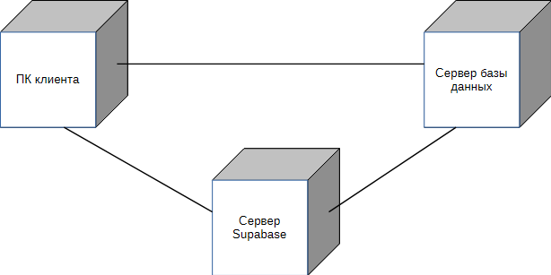

# Пояснительная записка

## РЕФЕРАТ

Курсовой проект: X с., X рис., X источников, X прил.

WINUI 3, .NET, SUPABASE, POSTGRESQL, RLS, ТРИГГЕРЫ, МЕТОДИЧЕСКИЙ ОТДЕЛ.

Объектом исследования является процесс учета, хранения и анализа учебно-методических данных в методическом отделе университета.

Предметом исследования является разработка архитектуры, модели данных и прикладной реализации автоматизированной информационной системы «Методический отдел университета».

При выполнении работы использованы методы системного анализа предметной области, функционального и информационного моделирования, проектирования реляционной базы данных, объектно-ориентированного проектирования, а также практические методы разработки и тестирования настольного приложения на платформе .NET/WinUI 3.

В процессе работы проведены следующие исследования и разработки: анализ предметной области и формализация требований; проектирование логической и физической модели данных PostgreSQL; реализация прикладного WinUI-приложения с CRUD-операциями для основных сущностей; разработка аналитических запросов, диаграмм и экспортных отчетов; внедрение разграничения доступа на базе Supabase Auth и RLS; реализация триггеров целостности и аудита на уровне СУБД.

Элементами научной новизны полученных результатов является комплексное сочетание прикладного интерфейса, политик RLS и триггерной серверной логики (ограничения учебного плана, нормализация формы контроля, аудит изменений), обеспечивающее согласованность данных и прослеживаемость операций при прямом доступе приложения к БД.

Областью возможного практического применения являются методические отделы учреждений высшего образования, деканаты и кафедры, где требуется централизованное ведение учебно-методической информации, подготовка аналитических выборок и формирование регламентированной отчетности.

Технико-экономическая и социальная значимость: внедрение системы сокращает трудозатраты на обработку и актуализацию данных, снижает количество ошибок ручного ввода, ускоряет подготовку управленческой отчетности и повышает прозрачность принятия решений в образовательной организации.

Автор подтверждает, что приведенный в работе расчетно-аналитический материал правильно и объективно отражает состояние исследуемого процесса, а все заимствованные из литературных и других источников теоретические, методологические и методические положения и концепции сопровождаются ссылками на их авторов.

## Оглавление

- [Пояснительная записка](#пояснительная-записка)
  - [РЕФЕРАТ](#реферат)
  - [Оглавление](#оглавление)
  - [ВВЕДЕНИЕ](#введение)
  - [1 ТЕОРЕТИЧЕСКАЯ ЧАСТЬ](#1-теоретическая-часть)
    - [1.1 Описание предметной области](#11-описание-предметной-области)
    - [1.2 Постановка задачи](#12-постановка-задачи)
    - [1.3 Обоснование выбора программных средств разработки программного приложения](#13-обоснование-выбора-программных-средств-разработки-программного-приложения)
  - [2 ПРАКТИЧЕСКАЯ ЧАСТЬ](#2-практическая-часть)
    - [2.1 Проектирование базы данных](#21-проектирование-базы-данных)
    - [2.2 Построение UML-диаграмм проекта](#22-построение-uml-диаграмм-проекта)
    - [2.3 Описание разработанных триггеров и хранимых процедур](#23-описание-разработанных-триггеров-и-хранимых-процедур)
    - [2.4 Описание методов защиты информации в приложении](#24-описание-методов-защиты-информации-в-приложении)
    - [2.5 Руководство пользователя программным продуктом](#25-руководство-пользователя-программным-продуктом)
  - [ЗАКЛЮЧЕНИЕ](#заключение)
  - [СПИСОК ИСПОЛЬЗОВАННЫХ ИСТОЧНИКОВ](#список-использованных-источников)
  - [ПРИЛОЖЕНИЯ](#приложения)
    - [ПРИЛОЖЕНИЕ А](#приложение-а)
    - [ПРИЛОЖЕНИЕ Б](#приложение-б)

## ВВЕДЕНИЕ

Актуальность темы курсового проекта обусловлена необходимостью цифровизации процессов учета и сопровождения учебно-методической информации в университете. В условиях постоянного обновления учебных планов, изменений в структуре кафедр и требований к отчетности применение разрозненных и слабо формализованных подходов к хранению данных снижает оперативность работы и повышает риск ошибок.

Методический отдел университета ежедневно работает с взаимосвязанными данными о факультетах, кафедрах, секциях, сотрудниках, дисциплинах, специальностях и учебной нагрузке. Для эффективного управления такими данными требуется единая информационная система, обеспечивающая централизованное хранение, удобное редактирование, целостность связей между сущностями и быстрый доступ к аналитической информации.

Целью курсового проекта является разработка автоматизированной информационной системы «Методический отдел университета», ориентированной на практическое применение в деятельности сотрудников методического отдела.

Для достижения поставленной цели в работе решаются следующие задачи:
1) анализ предметной области и выделение ключевых сущностей и связей;
2) проектирование структуры базы данных и правил целостности;
3) реализация программного приложения с пользовательским интерфейсом для выполнения основных операций;
4) реализация аналитических запросов по учебно-методическим данным;
5) организация формирования выходных отчетных документов;
6) внедрение механизмов аутентификации, разграничения доступа и аудита изменений.

Объектом исследования является процесс учета и сопровождения учебно-методических данных в методическом отделе университета.

Предметом исследования являются методы и программные средства разработки автоматизированной информационной системы методического отдела университета.

Практическая значимость работы заключается в создании прикладного программного инструмента, позволяющего повысить точность ведения данных, сократить трудозатраты при выполнении типовых операций и ускорить подготовку аналитической и отчетной информации для поддержки управленческих решений.

В результате выполнения проекта формируется основа для дальнейшего развития цифровых сервисов методического сопровождения образовательного процесса и повышения общей эффективности работы подразделений университета.

## 1 ТЕОРЕТИЧЕСКАЯ ЧАСТЬ

### 1.1 Описание предметной области

Предметная область курсового проекта связана с деятельностью методического отдела университета, который отвечает за сопровождение образовательного процесса на уровне факультетов, кафедр и учебных планов специальностей.

В рамках рассматриваемой области ведется учет следующих ключевых сущностей:
- факультеты;
- кафедры и предметно-методические секции;
- сотрудники (включая деканов, заведующих кафедрами и руководителей секций);
- специальности;
- дисциплины;
- элементы учебного плана по семестрам.

Для каждой специальности хранятся код, наименование, присваиваемая квалификация, продолжительность и форма обучения. Для дисциплин и учебных планов фиксируются семестр, объем часов по видам занятий (лекции, лабораторные, практические, УСР), наличие курсового проектирования и форма контроля.

Предметная область включает управленческие и организационные связи между объектами: принадлежность кафедры факультету, закрепление дисциплины за кафедрой, привязка дисциплины к специальности в конкретном семестре, распределение сотрудников по кафедрам и секциям, а также назначение ответственных должностных лиц.

С практической точки зрения система ориентирована на решение задач методического отдела: централизованное хранение и обновление данных, выполнение типовых аналитических запросов, подготовка отчетов для внутреннего использования, а также обеспечение согласованности и достоверности информации в базе данных.

Входными документами и источниками данных для ведения справочников и учебных планов в рамках текущей схемы БД: приказы и распоряжения о составе факультета, кафедры и секции, а также назначении декана или заведущего; выписки из государственных образовательных стандартов, учебных планов и рабочих учебных программ по специальностям; списки с контактной информацией и кадровые справки для информации о сотрудниках. Перечисленные материалы не импортируются в систему автоматически, а служат основанием для ручного ввода и корректировки записей в соответствующих разделах приложения.

Выходными документами, формируемыми со страницы «Отчёты» приложения, являются следующие файлы: сводная таблица в формате Excel с перечнем кафедр и количеством закреплённых за ними дисциплин; книга Excel с таблицей по каждой специальности (дисциплины по строкам, часы по видам занятий и отметки зачёта, экзамена и курсового проекта в виде «+»/«-»); документ Word с отчётом по кафедрам о читаемых дисциплинах. Данные для этих файлов агрегируются из уже введённых в БД сведений о кафедрах, специальностях, дисциплинах и элементах учебного плана.

### 1.2 Постановка задачи

Требуется создать программную систему, предназначенную для работника методического отдела университета. Такая система должна обеспечивать хранение сведений о специальностях, по которым ведет подготовку университет, и предметах, входящих в перечень подготовки по каждой специальности. Сведения о специальности — это код и название специальности, присваиваемая квалификация, продолжительность и форма обучения (дневная, вечерняя, заочная). Сведения о кафедре включают ее название, телефон (телефоны), факультет, к которому относится кафедра, данные о заведующем кафедрой (фамилия, имя, отчество, степень, звание). Сведения о дисциплине — это название дисциплины, в каком семестре (семестрах) и для каких специальностей она читается, сколько часов для каждой специальности отводится на лекции, лабораторные, УСР и практические занятия по этой дисциплине, есть ли курсовое проектирование и виды отчетности в форме зачета или экзамена, какая кафедра преподает дисциплину. Сотрудник методического отдела может внести в БД информацию о новой дисциплине, изменить количество часов, отводимых под тот или иной вид учебной программы, изменить название кафедры или факультета, сведения о заведующем кафедрой, номер телефона кафедры.

Необходимо реализовать следующие запросы:
- вывести дисциплины, по которым подготовка обеспечивается более, чем одной кафедрой;
- отобразить список дисциплин, которые читаются более одного семестра;
- отобразить список кафедр с количеством преподаваемых дисциплин;
- построить диаграмму: суммарное количество часов, отведенное на лабораторные по каждой кафедре в выбранном семестре;
- отсортировать кафедры по количеству преподаваемых дисциплин;
- сформировать документы: информация о кафедрах (Excel); по каждой специальности вывести таблицу, строками в которой будут преподаваемые дисциплины, а столбцами количество лекций, лабораторных, практических занятий, УСР, зачет, экзамен, курсовой проект (в столбцах «зачет, экзамен, курсовой проект» проставить знаки «+» или «-») (Excel); отчет по кафедрам о читаемых дисциплинах (название, семестры и специальности, в которых и для которых читается дисциплина, форма контроля) (Word);
- вывести разницу в часах, отведенных по каждой дисциплине на лабораторные и лекционные занятия в выбранном семестре выбранной кафедры;
- создать триггер, который запретит добавление в одном семестре для одной дисциплины, одной специальности одновременно форму контроля и зачет, и экзамен;
- создать триггер, который запретит добавление предмета для специальности, если в выбранном для добавления семестре количество предметов уже равно 7;
- создать триггер, который при указании присутствия курсового проектирования у предмета установит форму контроля этого предмета экзамен.

### 1.3 Обоснование выбора программных средств разработки программного приложения

В качестве платформы клиентского приложения выбрана WinUI 3 на .NET, что обеспечивает разработку современного нативного настольного интерфейса для Windows, удобного для сотрудников методического отдела и хорошо интегрированного с экосистемой Microsoft.

Для хранения данных используется PostgreSQL, развернутый в инфраструктуре Supabase. Такой выбор обеспечивает надежную реляционную модель данных, поддержку ограничений целостности, триггеров и расширенных механизмов безопасности.

Доступ к данным в приложении реализован через Entity Framework Core и Npgsql, что позволяет:
- работать с объектной моделью предметной области;
- использовать миграции для сопровождения структуры базы данных;
- централизованно реализовывать операции чтения, изменения и аналитические выборки.

Для аутентификации и разграничения прав применяются возможности Supabase Auth и политики Row Level Security (RLS). Это дает возможность безопасно разделять режимы чтения и изменения данных для разных категорий пользователей, включая анонимный и авторизованный доступ.

Архитектурно приложение построено с разделением на уровень пользовательского интерфейса и уровень бизнес-логики/доступа к данным. Такой подход упрощает сопровождение проекта, повторное использование компонентов и дальнейшее развитие функциональности.

Для формирования выходных документов выбран OpenXML (экспорт в Excel и Word), что соответствует требованиям предметной области по подготовке отчетности и обеспечивает совместимость с распространенными офисными инструментами.

Выбранный стек технологий позволяет реализовать прикладное решение [4,5], ориентированное на реальную эксплуатацию в методическом отделе: с удобным интерфейсом, контролем целостности данных на стороне СУБД и политиками доступа [8,9], поддержкой аналитики при доступе к данным через ORM и драйвер PostgreSQL [6,7], подготовкой формализованных отчётов в форматах Office на базе Open XML [10].

## 2 ПРАКТИЧЕСКАЯ ЧАСТЬ

### 2.1 Проектирование базы данных

Проектирование базы данных выполнялось с учетом структуры предметной области методического отдела университета и требований к целостности учебно-методической информации. В качестве СУБД использована PostgreSQL в инфраструктуре Supabase. Основу модели составляют таблицы, описывающие организационную структуру и учебный процесс: факультеты, кафедры, секции, сотрудники, специальности, дисциплины и элементы учебного плана. Такая декомпозиция позволила отделить справочные данные от оперативных записей и обеспечить устойчивую структуру для повседневной работы с данными.

На рисунке 2.1 приведена концептуальная модель системы. На уровне концепции зафиксированы оргструктура «факультет — кафедра — секция» и участие сотрудников в управлении и работе подразделений, а также учебный контур «дисциплина — учебный план — специальность» (семестр, часы, формы контроля).
На этапе логического проектирования концептуальные сущности и связи уточнены до реляционной структуры: для реализуемых в базе зависимостей определены первичные и внешние ключи, обеспечивающие ссылочную целостность при изменении организационных и учебных данных. Логическая модель приведена на рисунке 2.2.

 Рисунок 2.1 — Концептуальная модель базы данных

 Рисунок 2.2 — Логическая модель базы данных

Физическая реализация, приведенная на рисунке 2.3, включает первичные и внешние ключи, обязательные поля, значения по умолчанию и индексы для ускорения доступа к данным. Для операций аудита предусмотрена отдельная таблица журнала изменений, в которой фиксируются время операции, тип действия, изменяемая сущность и состояние данных до и после изменения. Это обеспечивает прослеживаемость изменений и повышает контролируемость работы системы в прикладной эксплуатации.

 Рисунок 2.3 — Физическая модель базы данных

Дополнительно на уровне базы данных реализованы триггерные проверки бизнес-правил. Они контролируют корректность связей между сотрудниками, секциями и кафедрами, а также предотвращают противоречивые состояния при назначении ответственных лиц. Перенос части правил в СУБД позволяет гарантировать целостность независимо от интерфейса, через который выполняются изменения.

С точки зрения нормализации схема соответствует требованиям реляционного проектирования для прикладной информационной системы. Атрибуты таблиц атомарны, повторяющиеся группы вынесены в отдельные сущности, а зависимости между неключевыми полями и ключами организованы таким образом, чтобы минимизировать избыточность и риск аномалий обновления. В результате получена устойчивая и расширяемая структура БД, покрывающая задачи хранения, аналитической обработки и подготовки отчетности в рамках методического отдела.

### 2.2 Построение UML-диаграмм проекта

Для описания архитектуры и поведения программного продукта применен набор UML-диаграмм, охватывающий пользовательские сценарии, структуру компонентов, развертывание и используемые шаблоны проектирования. Такой подход позволяет формализовать систему с разных точек зрения: функциональной, структурной и инфраструктурной.

Use-case диаграммы фиксируют роли пользователей и ключевые варианты использования системы. Для текущего проекта выделены сценарии сотрудника, рисунок 2.4, — общий обзор функций и управление данными, и администратора, рисунок 2.5, — управление доступом и просмотр журнала аудита.

 Рисунок 2.4 — Диаграмма Use-case сотрудника

 Рисунок 2.5 — Диаграмма Use-case администратора

Диаграмма классов для бизнес-логики показывает основные сервисы, интерфейсы, ViewModel и связи между ними на уровне прикладного слоя, без дублирования полной модели сущностей базы данных. Разделено на три поддиаграммы для удобного восприятия (рисунки 2.6 - 2.8). Классы без тела на одной диаграмме служат для отображения перехода в следующий слой, в котором находится их описание, поэтому не описаны.

 Рисунок 2.6 — Диаграмма классов слоя данных и инфраструктуры

 Рисунок 2.7 — Диаграмма классов слоя UI/ViewModel (справочник учебных планов — пример для страниц-списков и страниц-деталей)

 Рисунок 2.8 — Диаграмма классов слоя бизнес-логики и сервисов

На рисунке 2.9 приведена диаграмма деятельности работы со справочником БД на примере добавления нового учебного плана.

 Рисунок 2.9 — Диаграмма деятельности вставки нового учебного плана

На рисунке 2.10 приведена диаграмма последовательности для выполнения анализа количества лабораторных часов для каждой кафедры по семестрам.

 Рисунок 2.10 — Диаграмма последовательности составления отчета

На рисунке 2.11 приведена диаграмма компонентов. Решение Visual Studio состоит из двух проектов .App (проект графического окна) и .Bus (проект библиотеки классов), поэтому в приложении есть 1 исполняющий файл и две динамические библиотеки, которые в свою очередь используют dll сторонних пакетов, требуемых для отображения графиков, создания документов, доступа к данным и т.д.

 Рисунок 2.11 — Диаграмма компонентов

На рисунке 2.12 приведена диаграмма развертываний. Всего 3 вычислительных узла: компьютер пользователя, Supabase, выступающий посредником между пользователем и СУБД для реализации авторизации и edge-функций, и СУБД PostgreSQL. Связь с PostgreSQL происходит с помощью прямых подключений и для пользователя и для Supabase, а между пользователем и Supabase — посредством протокола https.

 Рисунок 2.12 — Диаграмма развертываний

### 2.3 Описание разработанных триггеров и хранимых процедур

В приложении реализован набор триггеров и серверных функций PostgreSQL, обеспечивающих контроль бизнес-правил и аудит операций на уровне базы данных. Такой подход позволяет гарантировать корректность данных независимо от того, из какого интерфейса или сервиса выполняется изменение записей.

В первую очередь реализованы триггеры, требуемые техническим заданием для таблицы curriculum_item. Триггер tr_curriculum_item_semester_limit срабатывает BEFORE INSERT OR UPDATE по полям specialty_id, semester и запрещает добавление или перенос записи, если для выбранной специальности в семестре уже семь дисциплин. Триггер tr_curriculum_item_control_form_model также выполняется BEFORE INSERT OR UPDATE и реализует два правила ТЗ: при has_course_project = true автоматически выставляется экзамен (is_exam = true) и снимается зачёт с оценкой (is_credit = false); запрещается конфликт формы контроля, когда одновременно указаны зачёт и экзамен (is_credit = true и is_exam = true).

```sql
-- Лимит предметов в семестре по специальности: не более 7 записей curriculum_item
-- в одной паре (specialty_id, semester). Маркер для распознавания на клиенте — HINT.
CREATE OR REPLACE FUNCTION check_curriculum_item_semester_limit()
RETURNS TRIGGER AS $$
DECLARE
    v_existing INTEGER;
    v_limit CONSTANT INTEGER := 7;
BEGIN
    IF TG_OP = 'INSERT' THEN
        SELECT COUNT(*) INTO v_existing
        FROM curriculum_item
        WHERE specialty_id = NEW.specialty_id
          AND semester = NEW.semester;

        IF v_existing >= v_limit THEN
            RAISE EXCEPTION
                'Нельзя добавить предмет: в выбранном семестре для данной специальности уже % предметов.', v_limit
                USING HINT = 'CURRICULUM_LIMIT_EXCEEDED';
        END IF;
    ELSIF TG_OP = 'UPDATE' THEN
        -- Проверяем только при переносе записи в другую (specialty, semester)-группу.
        IF NEW.specialty_id IS DISTINCT FROM OLD.specialty_id
           OR NEW.semester IS DISTINCT FROM OLD.semester THEN
            SELECT COUNT(*) INTO v_existing
            FROM curriculum_item
            WHERE specialty_id = NEW.specialty_id
              AND semester = NEW.semester
              AND id <> NEW.id;

            IF v_existing >= v_limit THEN
                RAISE EXCEPTION
                    'Нельзя перенести предмет: в выбранном семестре для данной специальности уже % предметов.', v_limit
                    USING HINT = 'CURRICULUM_LIMIT_EXCEEDED';
            END IF;
        END IF;
    END IF;

    RETURN NEW;
END;
$$ LANGUAGE plpgsql;

CREATE TRIGGER tr_curriculum_item_semester_limit
    BEFORE INSERT OR UPDATE OF specialty_id, semester ON curriculum_item
    FOR EACH ROW EXECUTE PROCEDURE check_curriculum_item_semester_limit();

-- Форма контроля curriculum_item:
--  1) Запрещено одновременно хранить зачёт и экзамен.
--  2) При курсовом проекте автоматически нормализуем форму контроля к экзамену.
CREATE OR REPLACE FUNCTION normalize_and_validate_curriculum_item_control_form()
RETURNS TRIGGER AS $$
BEGIN
    IF NEW.has_course_project THEN
        NEW.is_exam := TRUE;
        NEW.is_credit := FALSE;
    END IF;

    IF NEW.is_credit AND NEW.is_exam THEN
        RAISE EXCEPTION
            'Некорректная форма контроля: нельзя одновременно указать зачёт и экзамен.';
    END IF;

    RETURN NEW;
END;
$$ LANGUAGE plpgsql;

CREATE TRIGGER tr_curriculum_item_control_form_model
    BEFORE INSERT OR UPDATE OF has_course_project, is_credit, is_exam ON curriculum_item
    FOR EACH ROW EXECUTE PROCEDURE normalize_and_validate_curriculum_item_control_form();
```

Так как в приложении сделан автоматический выбор экзамена, при выставлении курсового проекта, то демонстрация работы tr_curriculum_item_control_form_model приведена на рисунках 2.13 и 2.14 посредством прямого взаимодействия с СУБД.

(Рисунок 2.13 — Автоматическое выставление экзамена при указании курсового проекта)

(Рисунок 2.14 — Ошибка при выставлении и зачёта и экзамена)

Правило о «менее 7 дисциплин в семестре» не обрабатывается автоматически в приложении, поэтому запрос отправляется и проверяется на стороне СУБД. При обнаружении проблемы возвращается ошибка, которая обрабатывается на стороне приложения сервисом DatabaseErrorRecognizer, который распознаёт ошибку триггера по HINT-маркеру и позволяет координировано вывести сообщение об ошибке для пользователя на форму. Пример работы приведен на рисунке 2.15.

(Рисунок 2.15 — Вывод ошибки о невозможности переноса (вставки в другой семестр) учебного плана)

Дополнительно реализованы триггеры целостности организационной структуры и аудита, не противоречащие ТЗ и повышающие надежность системы. Триггер tr_employee_section_department проверяет соответствие секции кафедре сотрудника. Триггеры tr_department_head_belongs и tr_employee_department_if_head контролируют корректность назначения/перевода заведующего кафедрой. Пара триггеров tr_section_head_belongs_or_unassigned и tr_section_assign_head  обеспечивает корректное назначение руководителя секции и, при необходимости, автоматическую привязку сотрудника к секции и кафедре. Для аудита изменений включены триггеры trg_audit_employee, trg_audit_faculty, trg_audit_department, trg_audit_section, trg_audit_specialty, trg_audit_discipline, trg_audit_curriculum_item, которые через функцию public.audit_log_row() сохраняют в audit_log тип операции, время, пользователя и снимки данных до/после изменения.

Хранимые процедуры в классическом понимании (с оператором CALL) в проекте не используются; серверная логика реализована функциями PostgreSQL. Ключевые из них: public.audit_log_row() (унифицированная запись аудита), public.is_app_admin() (проверка роли администратора для доступа к журналу).

Исходные тексты триггеров и функций вынесены в миграции базы данных и приводятся в [Приложении А](#приложение-а).

### 2.4 Описание методов защиты информации в приложении

Защита информации в приложении реализована на нескольких уровнях: аутентификация пользователя, разграничение прав доступа в базе данных, ограничения на уровне прикладной логики и аудит изменений.

Аутентификация выполняется через Supabase Auth. После входа пользователь получает JWT-токен, который используется для авторизованных запросов. В прикладном слое роль пользователя извлекается из токена и метаданных, что позволяет различать административные и обычные сценарии работы. Для административных операций управления пользователями дополнительно используется проверка роли администратора до выполнения запроса.

Ключевой механизм разграничения доступа реализован через Row Level Security в PostgreSQL. Для таблиц предметной области включены политики вида anon_select_* (только чтение для роли anon) и authenticated_all_* (полный доступ для роли authenticated), а также отдельные app_readonly_select_* для технического логина app_readonly. Для таблицы аудита задана политика authenticated_select_audit_log_admin, разрешающая чтение только при выполнении функции public.is_app_admin().

При прямом подключении приложения к PostgreSQL (через Npgsql/EF Core, минуя PostgREST) применяется интерцептор SupabaseRlsInterceptor. Он перед каждым SQL-запросом выполняет установку контекста сессии: SET ROLE anon либо SET ROLE authenticated, а также set_config('request.jwt.claim.sub', ...) и set_config('request.jwt.claims', ...). За счет этого политики RLS и функции, использующие auth.uid()/auth.jwt(), работают так же, как при обращении через Supabase API. Инициализация интерцептора выполняется в UserAwareAppDbContextFactory: в него передаются CurrentUser.Id и CurrentRole, после чего контекст БД создается уже с настроенным RLS-контекстом текущего пользователя, код приведён в [Приложении Б](#приложение-б).

На уровне приложения дополнительно используется проверка прав на изменение данных через признак доступности мутаций. Это позволяет отделить сценарии просмотра от сценариев редактирования и уменьшает риск выполнения недопустимых операций в пользовательском интерфейсе.

Важным элементом безопасности является аудит действий. Все изменения в основных таблицах фиксируются в журнале с сохранением контекста пользователя и состояния данных до и после операции. Такой подход повышает прозрачность работы системы, упрощает расследование инцидентов и обеспечивает контроль корректности административных действий.

Совокупность указанных мер формирует практическую модель защиты данных, ориентированную на реальные процессы методического отдела: ограничение доступа, контроль изменений и подтверждаемость действий пользователей.

### 2.5 Руководство пользователя программным продуктом

При запуске приложения пользователя приветствует домашняя страница (рисунок 2.16), где предлагается перейти к авторизации, а также основным навигационным пунктам приложения.

(Рисунок 2.16 — Домашняя страница)

Слева пользователю доступно меню навигации, которое дублирует пункты с домашней страницы. Оно отображается всегда и может быть минимизировано для экономии горизонтального пространства (как отображено на всех последующих примерах).

Дальнейший обзор будет проводится со стороны администратора, для обзора всех функций. Без авторизации у пользователя не будет доступа к изменениям данных, только просмотр.

На странице настроек (рисунок 2.17) пользователь может настроить оформления приложения под себя, изменить строку подключения к СУБД, а также просмотреть информацию о приложении.

(Рисунок 2.17 — Страница настроек)

В заголовке окна расположена строка глобального поиска, где пользователь может найти нужную запись среди всех справочников. Пример на рисунке 2.18.

(Рисунок 2.18 — Глобальный поиск)

При выборе страницы-списка какого-либо справочника (пример со кафедрами на рисунке 2.19) пользователю предоставляется список найденных записей (со статусом подключения к БД, данные могут быть сохранены в кеше), поле для поиска, а также возможность создания новой записи в текущем справочнике.

(Рисунок 2.19 — Страница-список справочника (кафедр))

При выборе записи из списка происходит переход на страницу деталей (рисунок 2.20), где пользователь может просмотреть подробную информацию, перейти на связанные записи, а также отредактировать запись с помощью бокового редактора. Задание записей из других справочников происходит с помощью поля поиска, аналогичного тому, что находится в заголовке окна, но работает он только в пределах требуемой области, например при установке заведующего кафедрой, поиск будет происходить только внутри справочника сотрудников.

(Рисунок 2.20 — Страница-деталей записи (кафедра))

Другой пример страницы-деталей — учебный план, рисунок 2.21. Здесь пользователь также может просмотреть подробную информацию, а также нагрузку в часах по видам занятий.

Здесь стоит отметить, что при выборе чекбокса «Курсовой проект», автоматически выставляется значение переключателя на «Экзамен», а сам переключать отключается и выводится сообщение-подсказка (рисунок 2.22).

(Рисунок 2.21 — Страница-деталей записи (учебный план))

(Рисунок 2.22 — Автоматическая корректировка формы контроля (без срабатывания триггера))

На страницах аналитики, пользователь может выбрать требуемый ему запрос, получить результат, а также дополнительно экспортировать во внешний DOCX или EXCEL (рисунки 2.23 - 2.27).

(Рисунок 2.23 — Запрос «Дисциплины нескольких кафедр»)

(Рисунок 2.24 — Запрос «Дисциплины более одного семестра»)

(Рисунок 2.25 — Запрос «Кафедры и количество дисциплин»)

(Рисунок 2.26 — Запрос «Кафедры, отсортированные по количеству дисциплин»)

(Рисунок 2.27 — Запрос «Разница лабораторных и лекционных часов»)

На странице диаграмм (рисунок 2.28) получить статистику лабораторных часов в семестре по каждой кафедре и сохранить в PNG.

(Рисунок 2.28 — Страница диаграмм)

На странице отчетов — составить комплексный свод данных и экспортировать во внешние файлы (рисунки 2.29 — 2.34).

(Рисунок 2.29 — Отчёт «Информация о кафедрах»)

(Рисунок 2.30 — Excel с информацией о кафедрах)

(Рисунок 2.31 — Отчет «Таблица по каждой специальности»)

(Рисунок 2.32 — Excel с информацией по каждой специальности)

(Рисунок 2.33 — Отчет по кафедрам о читаемых дисциплинах)

(Рисунок 2.34 — Word с отчетом читаемых дисциплин)

Отдельно, администратору доступны страницы журнала (рисунок 2.35) и страницы управления пользователями (рисунок 2.36), где он может просмотреть лог изменения в БД, а также создавать других пользователей (самих администраторов может создать только пользователь, имеющий прямой доступ к СУБД, посредством интерфейса Supabase Auth).

(Рисунок 2.35 — Журнал изменений)

(Рисунок 2.36 — Управление пользователями)

## ЗАКЛЮЧЕНИЕ

В ходе выполнения курсового проекта достигнута поставленная цель — разработано прикладное программное решение «Методический отдел университета», ориентированное на централизованное ведение, контроль и анализ учебно-методических данных. Реализация выполнена в формате настольного приложения на WinUI 3 с использованием .NET, что обеспечивает удобную работу пользователей в среде Windows и соответствует требованиям практического применения в подразделении.

В процессе разработки решены ключевые задачи, сформулированные во введении и постановке задачи. Выполнены анализ предметной области и проектирование реляционной структуры данных в PostgreSQL (Supabase) с учетом связей между факультетами, кафедрами, секциями, сотрудниками, дисциплинами, специальностями и элементами учебного плана. Реализованы механизмы обеспечения целостности на уровне СУБД, включая ограничения, триггеры бизнес-правил и аудит изменений. Для защиты данных внедрены аутентификация и разграничение доступа на основе политик Row Level Security, что обеспечивает контролируемый доступ к информации в зависимости от роли пользователя.

Практическая часть проекта подтверждает применимость разработанной системы для задач методического отдела. Приложение поддерживает ведение и актуализацию данных, выполнение аналитических запросов по учебной нагрузке и дисциплинам, а также формирование отчетных материалов и диаграмм, необходимых для организационной и управленческой деятельности. Использование единой модели данных и формализованных правил обработки снижает вероятность несогласованных изменений и повышает прозрачность работы с учебно-методической информацией.

Перспективы дальнейшего развития проекта связаны с расширением набора аналитических сценариев, развитием ролевой модели доступа, углублением автоматизации формирования отчетных документов и совершенствованием визуальных средств представления данных. Дополнительным направлением является развитие механизмов администрирования и мониторинга изменений, что позволит повысить управляемость системы при росте объема данных и числа пользователей.

## СПИСОК ИСПОЛЬЗОВАННЫХ ИСТОЧНИКОВ

1. Введение в системы баз данных. / Дейт, К. Дж. — М. : Вильямс, 2005. — 1328 с.
2. Инженерия программного обеспечения. / Соммервилл, И. — М. : Вильямс, 2002. — 624 с.
3. Системы баз данных. Полный курс / А. Сильбершатц, Г. Корт, С. Сударшан. — М. : Вильямс, 2003. — 1320 с.
4. Windows App SDK and WinUI documentation [сайт]. — URL: https://learn.microsoft.com/windows/apps/winui/ (дата обращения: 05.05.2026).
5. .NET documentation [сайт]. — URL: https://learn.microsoft.com/dotnet/ (дата обращения: 05.05.2026).
6. Entity Framework Core documentation [сайт]. — URL: https://learn.microsoft.com/ef/core/ (дата обращения: 05.05.2026).
7. Npgsql documentation [сайт]. — URL: https://www.npgsql.org/doc/ (дата обращения: 05.05.2026).
8. Supabase docs [сайт]. — URL: https://supabase.com/docs (дата обращения: 05.05.2026).
9. PostgreSQL: Documentation [сайт]. — URL: https://www.postgresql.org/docs/ (дата обращения: 05.05.2026).
10. Open XML SDK documentation [сайт]. — URL: https://learn.microsoft.com/office/open-xml/open-xml-sdk (дата обращения: 05.05.2026).

## ПРИЛОЖЕНИЯ

### ПРИЛОЖЕНИЕ А

**Триггеры и функции**

```sql
-- Сотрудник–секция: секция должна относиться к кафедре сотрудника
CREATE OR REPLACE FUNCTION check_employee_section_department()
RETURNS TRIGGER AS $$
BEGIN
  IF NEW.section_id IS NOT NULL AND NEW.department_id IS NOT NULL THEN
    IF (SELECT department_id FROM section WHERE id = NEW.section_id) IS DISTINCT FROM NEW.department_id THEN
      RAISE EXCEPTION 'Секция должна относиться к кафедре сотрудника';
    END IF;
  END IF;
  RETURN NEW;
END;
$$ LANGUAGE plpgsql;

CREATE TRIGGER tr_employee_section_department
  BEFORE INSERT OR UPDATE OF section_id, department_id ON employee
  FOR EACH ROW EXECUTE PROCEDURE check_employee_section_department();

-- Заведующий кафедрой должен быть сотрудником этой кафедры
-- (при назначении допускается department_id = NULL, затем
-- привязка через UPDATE employee)
CREATE OR REPLACE FUNCTION check_department_head_belongs()
RETURNS TRIGGER AS $$
DECLARE
  emp_dept_id INTEGER;
BEGIN
  IF NEW.head_id IS NOT NULL THEN
    SELECT department_id INTO emp_dept_id FROM employee WHERE id = NEW.head_id;
    IF emp_dept_id IS NOT NULL AND emp_dept_id IS DISTINCT FROM NEW.id THEN
      RAISE EXCEPTION 'Заведующий кафедрой должен быть сотрудником этой кафедры (employee.department_id = department.id)';
    END IF;
  END IF;
  RETURN NEW;
END;
$$ LANGUAGE plpgsql;

CREATE TRIGGER tr_department_head_belongs
  BEFORE INSERT OR UPDATE OF head_id ON department
  FOR EACH ROW EXECUTE PROCEDURE check_department_head_belongs();

-- Смена кафедры у сотрудника: если он заведующий, новая кафедра
-- должна совпадать с его кафедрой
CREATE OR REPLACE FUNCTION check_employee_department_if_head()
RETURNS TRIGGER AS $$
DECLARE
  dept_id INTEGER;
BEGIN
  IF NEW.department_id IS DISTINCT FROM OLD.department_id THEN
    SELECT id INTO dept_id FROM department WHERE head_id = NEW.id;
    IF dept_id IS NOT NULL AND NEW.department_id IS DISTINCT FROM dept_id THEN
      RAISE EXCEPTION 'Нельзя перевести заведующего кафедрой в другую кафедру; сначала назначьте другого заведующего';
    END IF;
  END IF;
  RETURN NEW;
END;
$$ LANGUAGE plpgsql;

CREATE TRIGGER tr_employee_department_if_head
  BEFORE UPDATE OF department_id ON employee
  FOR EACH ROW EXECUTE PROCEDURE check_employee_department_if_head();

-- Руководитель секции: если у сотрудника ещё не указаны
-- кафедра/секция — назначаем автоматически, иначе ошибка
CREATE OR REPLACE FUNCTION check_section_head_belongs_or_unassigned()
RETURNS TRIGGER AS $$
DECLARE
  emp_section_id INTEGER;
  emp_dept_id INTEGER;
BEGIN
  IF NEW.head_id IS NOT NULL THEN
    SELECT section_id, department_id INTO emp_section_id, emp_dept_id
    FROM employee WHERE id = NEW.head_id;
    -- Уже привязан к другой секции/кафедре — ошибка
    IF (emp_section_id IS NOT NULL OR emp_dept_id IS NOT NULL)
       AND (emp_section_id IS DISTINCT FROM NEW.id OR emp_dept_id IS DISTINCT FROM NEW.department_id) THEN
      RAISE EXCEPTION 'Руководитель секции уже привязан к другой кафедре/секции; назначьте сотрудника без кафедры/секции или смените привязку вручную';
    END IF;
  END IF;
  RETURN NEW;
END;
$$ LANGUAGE plpgsql;

CREATE TRIGGER tr_section_head_belongs_or_unassigned
  BEFORE INSERT OR UPDATE OF head_id ON section
  FOR EACH ROW EXECUTE PROCEDURE check_section_head_belongs_or_unassigned();

-- Автоназначение: если кафедра/секция у сотрудника не указаны —
-- привязываем к этой секции (AFTER — секция уже существует)
CREATE OR REPLACE FUNCTION assign_section_head_to_section()
RETURNS TRIGGER AS $$
BEGIN
  IF NEW.head_id IS NOT NULL THEN
    UPDATE employee
    SET section_id = NEW.id,
      department_id = NEW.department_id
    WHERE id = NEW.head_id
      AND section_id IS NULL
      AND department_id IS NULL;
  END IF;
  RETURN NEW;
END;
$$ LANGUAGE plpgsql;

CREATE TRIGGER tr_section_assign_head
  AFTER INSERT OR UPDATE OF head_id ON section
  FOR EACH ROW EXECUTE PROCEDURE assign_section_head_to_section();
```

### ПРИЛОЖЕНИЕ Б

**Управление доступом**

```sql
-- RLS: неавторизованные (anon) — только чтение, авторизованные (authenticated) — полный доступ (из Supabase Auth)

-- employee
ALTER TABLE employee ENABLE ROW LEVEL SECURITY;

CREATE POLICY "anon_select_employee" ON employee FOR SELECT TO anon USING (true);
CREATE POLICY "authenticated_all_employee" ON employee FOR ALL TO authenticated USING (true) WITH CHECK (true);

-- faculty
ALTER TABLE faculty ENABLE ROW LEVEL SECURITY;

CREATE POLICY "anon_select_faculty" ON faculty FOR SELECT TO anon USING (true);
CREATE POLICY "authenticated_all_faculty" ON faculty FOR ALL TO authenticated USING (true) WITH CHECK (true);

-- department
ALTER TABLE department ENABLE ROW LEVEL SECURITY;

CREATE POLICY "anon_select_department" ON department FOR SELECT TO anon USING (true);
CREATE POLICY "authenticated_all_department" ON department FOR ALL TO authenticated USING (true) WITH CHECK (true);

-- section
ALTER TABLE section ENABLE ROW LEVEL SECURITY;

CREATE POLICY "anon_select_section" ON section FOR SELECT TO anon USING (true);
CREATE POLICY "authenticated_all_section" ON section FOR ALL TO authenticated USING (true) WITH CHECK (true);

-- specialty
ALTER TABLE specialty ENABLE ROW LEVEL SECURITY;

CREATE POLICY "anon_select_specialty" ON specialty FOR SELECT TO anon USING (true);
CREATE POLICY "authenticated_all_specialty" ON specialty FOR ALL TO authenticated USING (true) WITH CHECK (true);

-- discipline
ALTER TABLE discipline ENABLE ROW LEVEL SECURITY;

CREATE POLICY "anon_select_discipline" ON discipline FOR SELECT TO anon USING (true);
CREATE POLICY "authenticated_all_discipline" ON discipline FOR ALL TO authenticated USING (true) WITH CHECK (true);

-- curriculum_item
ALTER TABLE curriculum_item ENABLE ROW LEVEL SECURITY;

CREATE POLICY "anon_select_curriculum_item" ON curriculum_item FOR SELECT TO anon USING (true);
CREATE POLICY "authenticated_all_curriculum_item" ON curriculum_item FOR ALL TO authenticated USING (true) WITH CHECK (true);

-- app_readonly: login for app/tests (DefaultConnection). NOINHERIT + GRANT anon/authenticated so
-- SupabaseRlsInterceptor can SET LOCAL role; direct session is read-only (SELECT policies only).
CREATE ROLE app_readonly WITH LOGIN PASSWORD 'app_readonly_local' NOINHERIT;

GRANT anon TO app_readonly;
GRANT authenticated TO app_readonly;

GRANT CONNECT ON DATABASE postgres TO app_readonly;
GRANT USAGE ON SCHEMA public TO app_readonly;
GRANT SELECT ON ALL TABLES IN SCHEMA public TO app_readonly;
ALTER DEFAULT PRIVILEGES FOR ROLE postgres IN SCHEMA public GRANT SELECT ON TABLES TO app_readonly;

CREATE POLICY "app_readonly_select_employee" ON employee FOR SELECT TO app_readonly USING (true);
CREATE POLICY "app_readonly_select_faculty" ON faculty FOR SELECT TO app_readonly USING (true);
CREATE POLICY "app_readonly_select_department" ON department FOR SELECT TO app_readonly USING (true);
CREATE POLICY "app_readonly_select_section" ON section FOR SELECT TO app_readonly USING (true);
CREATE POLICY "app_readonly_select_specialty" ON specialty FOR SELECT TO app_readonly USING (true);
CREATE POLICY "app_readonly_select_discipline" ON discipline FOR SELECT TO app_readonly USING (true);
CREATE POLICY "app_readonly_select_curriculum_item" ON curriculum_item FOR SELECT TO app_readonly USING (true);
```

```csharp
/// <summary>
/// Фабрика контекста БД: берёт строку подключения из
/// <see cref="IDatabaseConnectionStringProvider"/> (override в Credential Manager или
/// <c>ConnectionStrings:DefaultConnection</c>) и текущего пользователя из
/// <see cref="IAuthService"/>, создаёт <see cref="SupabaseRlsInterceptor"/> с userId и возвращает
/// <see cref="AppDbContext"/> с этим интерцептором для применения RLS (anon/authenticated).
/// </summary>
public sealed class UserAwareAppDbContextFactory : IAppDbContextFactory
{
  private readonly IDatabaseConnectionStringProvider _connectionStringProvider;
  private readonly IAuthService _authService;

  public UserAwareAppDbContextFactory(IDatabaseConnectionStringProvider connectionStringProvider, IAuthService authService)
  {
    _connectionStringProvider = connectionStringProvider;
    _authService = authService;
  }

  public ValueTask<AppDbContext> CreateDbContextAsync(CancellationToken cancellationToken = default)
  {
    cancellationToken.ThrowIfCancellationRequested();

    var connectionString = _connectionStringProvider.GetEffectiveConnectionString();

    var sanitized = System.Text.RegularExpressions.Regex.Replace(connectionString, @"(Password=)[^;]*", "$1***", System.Text.RegularExpressions.RegexOptions.IgnoreCase);
    Debug.WriteLine($"[UserAwareAppDbContextFactory] CreateDbContext: connection (sanitized): {sanitized}");

    var userId = _authService.CurrentUser?.Id;
    var appRole = _authService.CurrentRole;
    var interceptor = new SupabaseRlsInterceptor(userId, appRole);

    var options = new DbContextOptionsBuilder<AppDbContext>()
      .UseNpgsql(connectionString)
      .AddInterceptors(interceptor)
      .Options;

    return ValueTask.FromResult(new AppDbContext(userId, options));
  }
}
```

```csharp
/// <summary>
/// Интерцептор EF Core, выставляющий перед каждым SQL-запросом
роль и request.jwt.claims, чтобы политики RLS в PostgreSQL работали
/// authenticated — полный доступ с учётом auth.uid() при необходимости.
/// </summary>
public sealed class SupabaseRlsInterceptor : DbCommandInterceptor
{
  private readonly string? _userId;
  private readonly string? _appRole;

  /// <summary>Создаёт интерцептор с указанным идентификатором пользователя для роли и JWT-claims.</summary>
  /// <param name="userId">Идентификатор пользователя (null — роль anon, иначе authenticated с sub в claims).</param>
  /// <param name="appRole">Роль приложения (например, admin) для app_metadata.role в JWT-claims.</param>
  public SupabaseRlsInterceptor(string? userId, string? appRole = null)
  {
    _userId = string.IsNullOrWhiteSpace(userId) ? null : userId;
    _appRole = string.IsNullOrWhiteSpace(appRole) ? null : appRole;
  }

  private void ApplySessionContext(DbCommand command)
  {
    using var setupCommand = command.Connection!.CreateCommand();
    setupCommand.Transaction = command.Transaction;
    setupCommand.CommandText = BuildSetupSql();
    _ = setupCommand.ExecuteNonQuery();
  }

  private async Task ApplySessionContextAsync(DbCommand command, CancellationToken cancellationToken)
  {
    await using var setupCommand = command.Connection!.CreateCommand();
    setupCommand.Transaction = command.Transaction;
    setupCommand.CommandText = BuildSetupSql();
    _ = await setupCommand.ExecuteNonQueryAsync(cancellationToken).ConfigureAwait(false);
  }

  private string BuildSetupSql()
  {
    if (_userId is null)
    {
      return "SET ROLE anon; SELECT set_config('request.jwt.claim.sub', '', false); SELECT set_config('request.jwt.claims', '{}', false);";
    }

    var claimsPayload = new Dictionary<string, object?>(StringComparer.Ordinal)
    {
      ["sub"] = _userId
    };

    if (_appRole is not null)
    {
      claimsPayload["app_metadata"] = new Dictionary<string, string>(StringComparer.Ordinal)
      {
        ["role"] = _appRole
      };
    }

    var claims = JsonSerializer.Serialize(claimsPayload);
    var escapedClaims = claims.Replace("'", "''", StringComparison.Ordinal);
    var escapedSub = _userId.Replace("'", "''", StringComparison.Ordinal);
    return $"SET ROLE authenticated; SELECT set_config('request.jwt.claim.sub', '{escapedSub}', false); SELECT set_config('request.jwt.claims', '{escapedClaims}', false);";
  }
}
```
